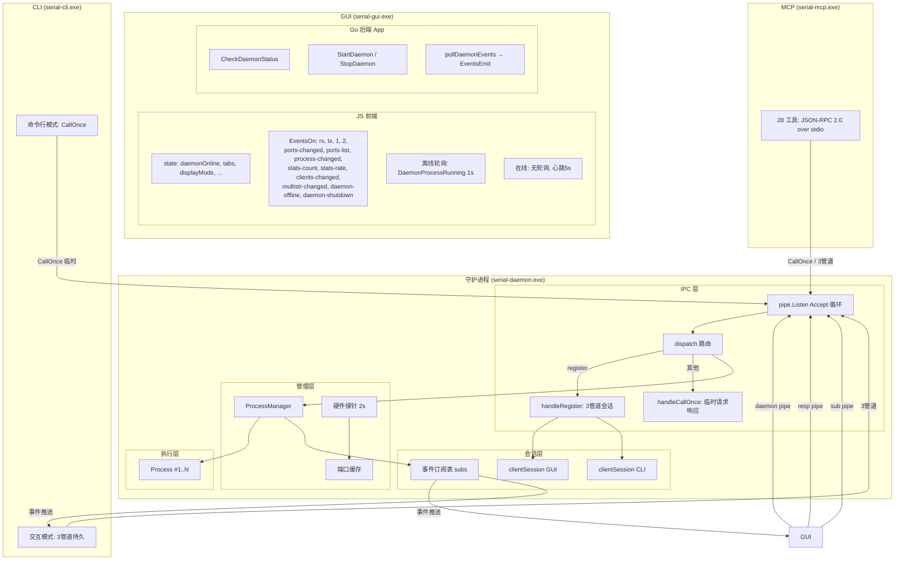
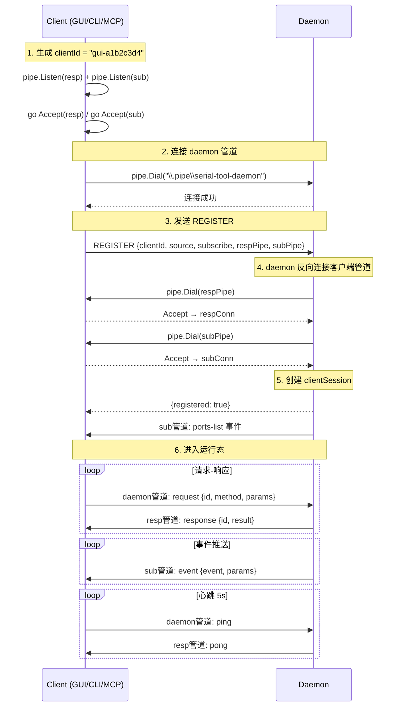
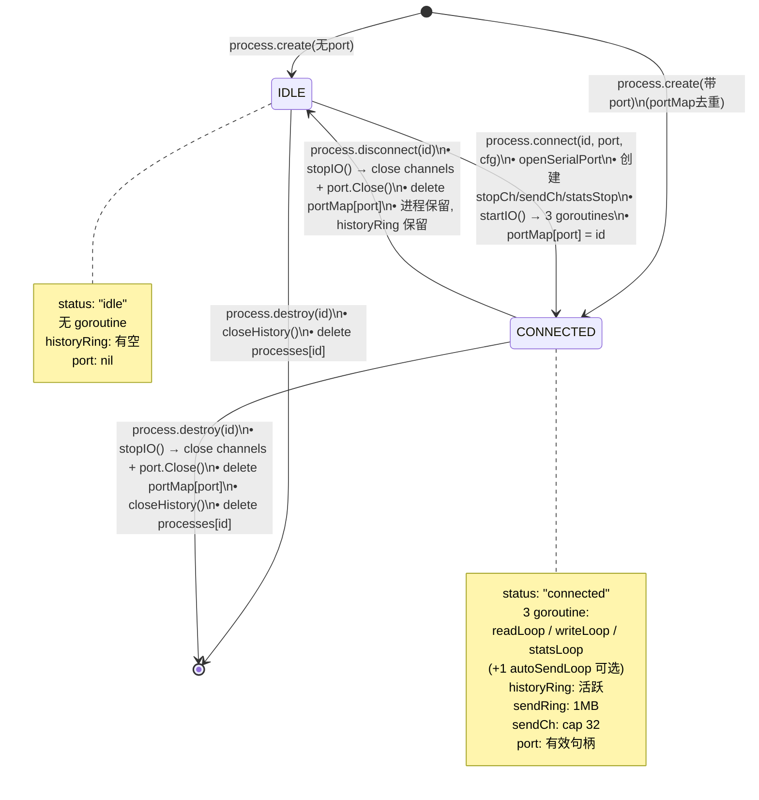
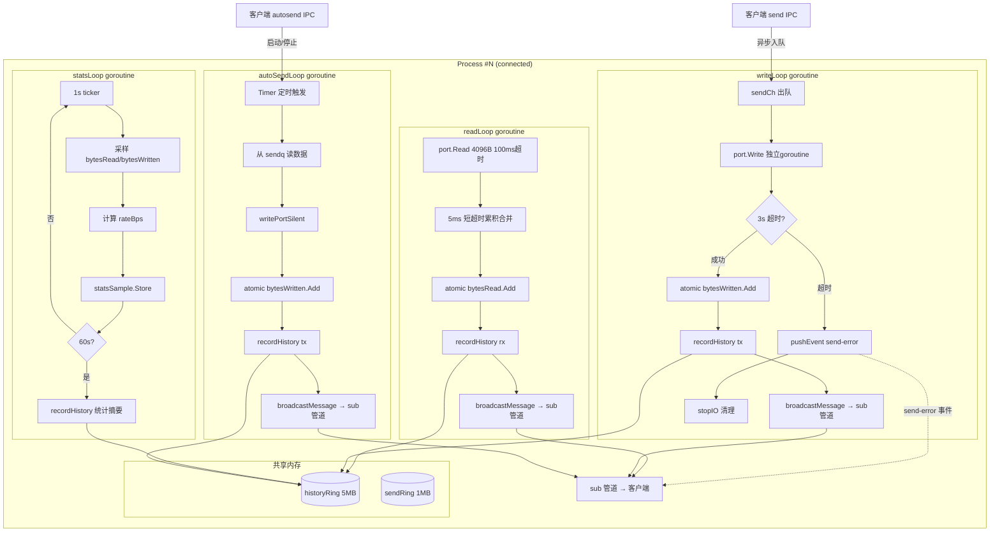
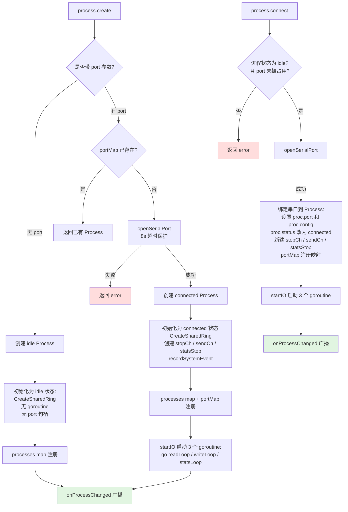
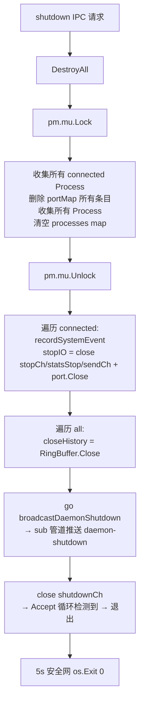
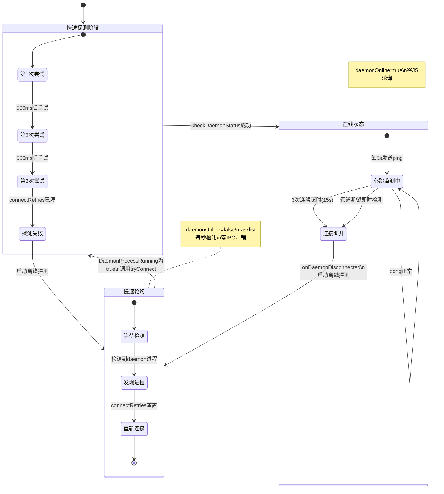
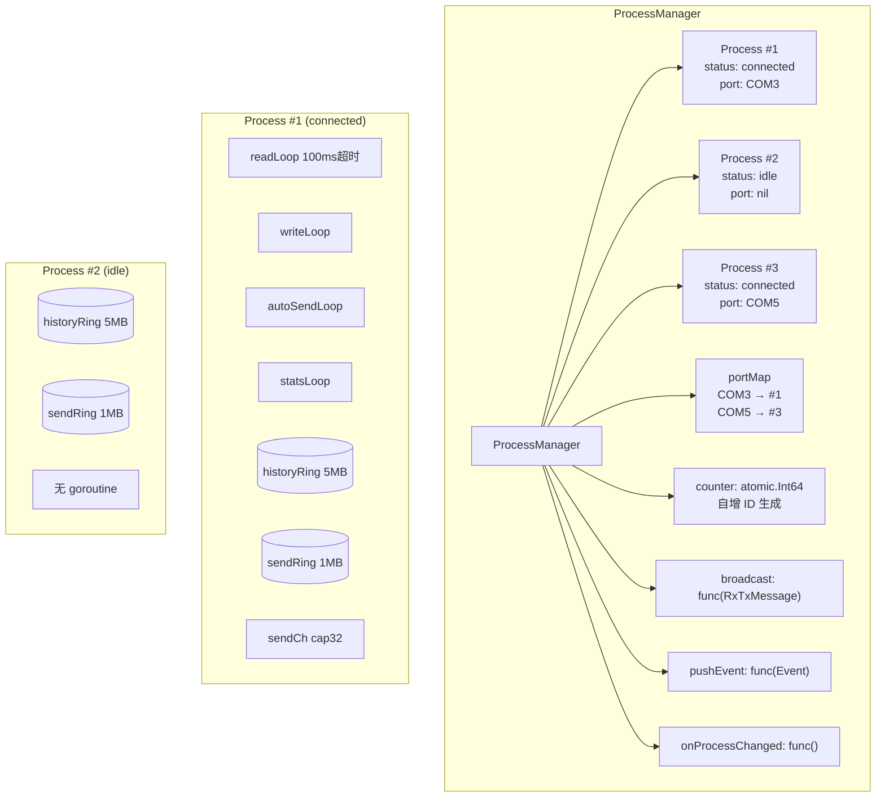

# 串口调试工具 v0.6.4 框架文档

## 一、整体框架

```
GUI / CLI(交互) / MCP
    │
    ├── \\.\pipe\serial-tool-daemon ──► daemon   注册 + 请求 (客户端→守护进程)
    ├── \\.\pipe\st-{id}-resp ◄──────── daemon   响应 (守护进程→客户端)
    └── \\.\pipe\st-{id}-sub  ◄──────── daemon   事件推送 (守护进程→客户端)

CLI 命令行 ──── CallOnce ────► daemon   临时请求+响应

serial-daemon (守护进程)
    ├── ProcessManager (进程生命周期)
    ├── 硬件探针 (2s 自动扫描)
    ├── 设备探测引擎 (手动触发，TOML 规则)
    └── 共享内存环形缓冲区 (每进程独立)
```

Go + Wails 跨平台串口调试工具，3 管道 IPC 架构 + 共享内存环形缓冲区 + 心跳连接管理。

- **守护进程**: 单实例（Windows 互斥体 `Global\serial-tool-daemon`），ProcessManager 管理 idle/connected 双状态 + mode(single/forward)，端口双向映射去重，日志跟随语言设置
- **GUI**: Wails v2，3 管道持久连接 + 双重断连检测，纯事件驱动无轮询，转发模式双端口行+分栏设置，自定义下拉组件（圆角弹出窗+动态高度+箭头旋转），9 语言 UI（中/英/繁/法/西/俄/阿/日/韩）
- **CLI**: 交互模式用 3 管道，命令行模式用 CallOnce 临时管道，34 条命令（含 declare、multistr、history-* 命令族）
- **MCP**: Model Context Protocol over stdio，28 个工具覆盖全部功能（含 serial_declare、serial_multistr_save/load/status）

### 系统架构图



---

## 二、IPC 通信架构

### 2.1 管道架构

Windows 命名管道 IPC，字节模式同步 I/O，换行分隔 JSON-RPC。

#### 持久客户端 (GUI / CLI交互 / MCP)

每个客户端注册时建立 3 条独立单向管道：

| 管道 | 名称 | 方向 | 创建者 | 用途 |
|------|------|------|--------|------|
| daemon 管道 | `\\.\pipe\serial-tool-daemon` | 客户端→守护进程 | daemon | 注册 + 请求发送 |
| resp 管道 | `\\.\pipe\st-{clientId}-resp` | 守护进程→客户端 | client | 响应返回 |
| sub 管道 | `\\.\pipe\st-{clientId}-sub` | 守护进程→客户端 | client | 事件推送 |

#### 临时客户端 (CLI 命令行)

通过 CallOnce 在 daemon 管道上完成请求-响应，完成后断开。

### 2.2 管道规格

| 属性 | 服务端 | 客户端 |
|------|--------|--------|
| 创建 | `CreateNamedPipeW` | `CreateFileW` |
| 模式 | `PIPE_TYPE_BYTE \| PIPE_WAIT` | 同步 I/O（无 OVERLAPPED） |
| 实例 | `PIPE_UNLIMITED_INSTANCES` (255) | — |
| 缓冲区 | 入/出 65536 字节 | — |
| 分帧 | `\n`（应用层） | `\n` |

### 2.3 注册时序



### 2.4 协议格式

**注册**
```json
{"id":0, "method":"register", "params":{"clientId":"gui-xxx", "source":"gui", "subscribe":["rx","tx",...], "respPipe":"...", "subPipe":"..."}}
```

**请求**
```json
{"id":1, "method":"process.create", "params":{"port":"COM13","baud":115200}, "clientId":"gui-xxx", "source":"gui"}
```

**响应**
```json
{"id":1, "result":{"processId":"1","connected":true,"success":true}}
```

**事件**（无 id 字段）
```json
{"event":"rx", "params":{"processId":"1","hex":"48656C6C6F","timestamp":"13:00:06.123"}}
```

### 2.5 IPC 方法

| 方法 | 参数 | 响应 |
|------|------|------|
| `register` | `clientId, source, subscribe, respPipe, subPipe` | `{"registered":true}`（注册后立即推送 ports-list + process-changed） |
| `ping` | — | `{"pong":"ok"}`（静默） |
| `subscribe` | `events: ["rx","tx",...]`（空数组推送全部已订阅状态） | `{"subscribed": N}`（订阅后立即推送对应状态） |
| `status` | — | `{"status":"ok"}` |
| `ports` | — | `{"ports":[...]}` |
| `ports.refresh` | — | `{"ports":[...]}` + 变化时广播 |
| `ports.probe` | `ports? baudRates? rules? configPath?` | `{"results":[{port,baud,rule,description}]}` |
| `process.create` | `mode? port? baud? ... portB? baudB? ... connect?` | `{"processId","connected","success"}` — `connect: false` 声明配置不打开端口 |
| `process.destroy` | `processId` | `{"success"}` |
| `process.connect` | `processId port baud? ...` | `{"success"}` |
| `process.disconnect` | `processId` | `{"success"}` |
| `process.switch` | `processId port baud? ...` | `{"success"}` |
| `process.setmode` | `processId mode` | `{"success"}`（需 idle 状态） |
| `process.watch` | `processId` | `{"success"}` — 声明查看此进程（GUI 注册时自动观察全部进程，CLI/MCP 在 connect/send 时自动追踪） |
| `process.unwatch` | `processId` | `{"success"}` — 主动停止观察指定进程，移除查看计数 |
| `process.watched` | — | `{"processIds":[...]}` — 查询当前 session 正在查看的进程 ID 列表 |
| `forward.create` | `portA baudA portB baudB ...` | `{"processId","success"}`（向后兼容，内部转 process.create） |
| `process.list` | — | `{"processes":[{processId,status,mode,...}]}` |
| `session.send` | `processId data format` | `{"success"}`（异步入队） |
| `session.history` | `processId` | `{"history":[...],"sharedName":"..."}` |
| `session.stats` | `processId` | `{"stats":{...}}` |
| `threads` | — | `{"goroutines":N,"sessions":[...]}` |
| `goroutines` | — | `{"goroutines":N,"stack":"..."}` |
| `client.list` | — | `{"clients":[{clientId,source,pid,connectTime,reqCount,subs}]}` |
| `session.clearhistory` | `processId` | `{"success"}` — 重置环形缓冲区 |
| `send.trigger` | `processId raw?` | `{"success"}` — 从 sendq 读一条进 sendCh（`raw:true` 跳过 multistr 解码，0.6.4 新增） |
| `send.ringname` | `processId` | `{"sharedName":"..."}` — 发送队列共享内存名 |
| `autosend.start` | `processId intervalMs mode loop?` | `{"success"}` — 启动 autoSendLoop（mode: single/queue） |
| `autosend.stop` | `processId` | `{"success"}` |
| `autosend.status` | `processId` | `{"status":{...}}` |
| `autosend.interval` | `processId intervalMs` | `{"success"}` — 运行中修改间隔 |
| `multistr.save` | `processId` | `{"success"}` — 持久化条目到 `multistr/<pid>.json` |
| `multistr.load` | `processId` | `{"success"}` — 从磁盘加载条目写入 sendq |
| `multistr.reload` | `processId` | `{"success"}` — 从 sendq 刷新缓存（发送中动态更新） |
| `multistr.read` | `processId` | 读取 sendq 条目（GUI 同步用） |
| `multistr.write` | `processId` | 写入条目到 sendq（GUI 同步用） |
| `history.files` | — | `{"files":[...]}` — 列出 `history/*.log` 文件及元信息 |
| `history.search` | `path keyword limit? offset?` | 二进制帧顺序扫描，分页返回（`hasMore` / `nextOffset`） |
| `history.enable` | `enabled` | `{"success"}` — 开关历史自动保存 |
| `history.status` | — | `{"enabled":bool}` |
| `history.attach` | `processId path` | 加载已有文件到环形缓冲区 + 打开追加 |
| `history.new` | `processId` | 为进程新建历史文件 |
| `history.detach` | `processId` | 分离当前文件（保留在磁盘） |
| `shutdown` | — | `{"success"}` |

### 2.6 推送事件

| 事件 | 触发 | 范围 |
|------|------|------|
| `ports-list` | 客户端注册后 | 仅订阅客户端 |
| `rx` / `tx` | 单端口模式串口数据收发 | 仅订阅客户端 |
| `1` / `2` | 转发模式：端口1→端口2 / 端口2→端口1 | 仅订阅客户端 |
| `clients-changed` | 客户端连接/断开时 | 仅订阅客户端 |
| `send-error` | 异步写入失败/超时 | 仅订阅客户端 |
| `ports-changed` | 端口硬件变化 | 仅订阅客户端 |
| `process-changed` | 进程创建/销毁/连接/断开/模式切换/查看变更 | 仅订阅客户端（含 viewers 计数） |
| `stats-count` | readLoop/writeLoop/autoSendLoop 数据变化时 | 仅订阅客户端 |
| `stats-rate` | statsLoop 每秒采样速率 | 仅订阅客户端 |
| `multistr-changed` | 多字符串条目/发送状态变更（保存、加载、重载、条目更新、队列轮次结束） | 仅订阅客户端 |
| `daemon-shutdown` | 守护进程即将关闭 | 仅订阅客户端 |

### 2.7 断连检测（双重机制）

**即时检测** — `readSubLoop` 和 `readRespLoop` 在管道读取返回 `ERROR_BROKEN_PIPE` 时立即触发 `OnDisconnect` 回调，无需等待心跳超时。daemon 被 kill 时 GUI 可在 < 1s 内显示离线。

**心跳兜底** — 客户端每 5s 发送 `ping` 请求（静默不记日志），daemon 在 resp 管道返回 `pong`。连续 3 次超时（15s）判定连接断开，作为防御性兜底机制。

### 2.8 超时参数

| 超时 | 值 |
|------|-----|
| `WaitNamedPipeW` | 5s |
| 注册 resp/sub 管道 | 5s |
| `Call()` 响应 | 10s |
| `ping` 心跳（单次） | 3s |
| `serial.Open` | 8s |
| `port.Write` | 3s |
| `ports.probe 读取响应` | 200ms（可配置） |

---

## 三、Daemon 守护进程

### 3.1 启动

```
serial-daemon.exe [--silent]
  → AcquireLock (互斥体)
  → NewProcessManager (processes map + portMap 双向映射)
  → NewIpcServer (端口扫描 + 硬件探针 + 管道监听)
  → Accept 循环（处理 register / CallOnce）
```

`--silent`：后台静默（GUI/CLI 使用）；无参数：前台控制台。

### 3.2 核心数据结构

```
ProcessManager {
    processes         map[processId]*Process   // idle | connected
    portMap           map[portName]processId   // 去重双向映射
    broadcast         func(RxTxMessage)
    pushEvent         func(protocol.Event)
    onProcessChanged  func()                   // 进程状态变更回调
}

Process {
    id, status, mode, config, port
    historyRing *ringbuf.RingBuffer   // 历史共享内存环形缓冲区 5MB
    historyName string                // serial-tool-history-{id}
    historyFile *os.File              // 持久化历史文件句柄（惰性创建，双写追加）
    sendCh chan sendJob               // 异步发送队列 (cap 32)
    stopCh / statsStop                // goroutine 控制
    stopOnce sync.Once                // 确保 stopIO 只执行一次
    // atomic counters: bytesRead, bytesWritten, bytesPort1, bytesPort2, readErrors, writeErrors

    // 0.4.6 新增：发送队列和自动发送
    sendRing / sendRingName           // 发送队列共享内存 serial-tool-sendq-{id} 1MB
    autoSendEnabled / autoSendMode    // 自动发送状态
    autoSendStopCh / autoSendOnce     // 自动发送 goroutine 控制
    autoSendSendCount / autoSendErrorCount / autoSendLastSend
    portWriteMu                       // 串行化 port.Write（writeLoop + autoSendLoop）
    broadcastFn / pushEventFn         // 回调（用于 autoSendLoop 广播 tx 事件）
}

IpcServer {
    sessions     map[string]*clientSession  // clientId → 3 管道会话
    pm           *ProcessManager
    cachedPorts  []portInfo
    hwProbe      2s 间隔硬件端口探针
}

clientSession {
    clientId, source, pid
    daemonConn   // 客户端→守护进程（读取请求）
    respConn     // 守护进程→客户端（写入响应）
    subConn      // 守护进程→客户端（推送事件）
    subs         map[string]bool  // 事件订阅表
}
```

单端口 connected 进程 3 个 goroutine：`readLoop` + `writeLoop` + `statsLoop`；forward 模式 2 个 `forwardLoop`。
idle 进程无 goroutine。自动发送启动时额外 1 个 goroutine：`autoSendLoop`，停止后销毁。

### 3.3 进程生命周期状态机



**快速参考：**
```
process.create(无port) → idle (可指定 mode)
process.create(带port, mode=single) → connected (查 portMap 去重)
process.create(带port, mode=forward) → connected (双端口，双向转发)
process.setmode         → idle 状态下切换 single ↔ forward
process.connect        → idle → connected
process.disconnect     → connected → idle (stopIO, 进程保留)
process.destroy        → 有连接先 disconnect → 删除 + closeHistory
```

每个变更操作末尾调用 `pm.onProcessChanged()`，触发 `process-changed` 事件广播。写入超时使用 `stopOnce` 统一清理。

### 3.4 dispatch 路由

| 方法 | 处理 |
|------|------|
| `register` | 建立 3 管道会话，返回注册确认 |
| `ping` | 静默返回 pong（心跳，不记日志） |
| `subscribe` | 更新会话事件订阅表 |
| `status` | 静默返回 ok（手动健康检查） |
| `ports` / `ports.refresh` | 缓存 / 刷新 + 变化广播 |
| `ports.probe` | 加载 TOML 规则 → 跳过已连接端口 → 逐端口/波特率/规则发探针帧 → 匹配响应 |
| `process.create` | pm.Create(mode, port, cfg, cfgB) — 支持 mode="forward" 双端口 |
| `process.destroy` | pm.Destroy(id) |
| `process.connect` / `process.disconnect` | pm.Connect / Disconnect |
| `process.switch` | pm.SwitchPort — 关闭旧端口→打开新端口，保留进程 |
| `process.setmode` | pm.SetMode — idle 状态下切换 single ↔ forward |
| `process.watch` | pm.AddViewer — 记录客户端查看进程，切换/断开自动清理 |
| `forward.create` | pm.ForwardCreate — 向后兼容，内部转 Create("forward", ...) |
| `process.list` | pm.List() — 返回 mode 字段 |
| `session.send` | pm.Send → sendCh 异步入队 |
| `session.history` | pm.GetHistory → 返回 sharedName + 数据 |
| `session.stats` | pm.GetStats |
| `shutdown` | DestroyAll → 异步 broadcast + close(shutdownCh) + 5s 安全退出 |
| `send.trigger` | pm.SendTrigger — 从 sendq 读一条 → sendCh（正常广播+历史） |
| `send.ringname` | pm.GetSendRingName — 返回 sendq 共享内存名 |
| `session.clearhistory` | pm.ClearHistory — 重置环形缓冲区 |
| `autosend.start` | pm.AutoSendStart — 启动 autoSendLoop goroutine |
| `autosend.stop` | pm.AutoSendStop — 关闭 autoSendLoop goroutine |
| `autosend.status` | pm.AutoSendStatus — 查询自动发送状态 |
| `autosend.interval` | pm.AutoSendSetInterval — 运行中修改间隔 |
| `history.files` | listHistoryFiles(historyDir()) — 列出 `history/*.log` 文件及元信息 |
| `history.search` | searchHistoryFile(path, keyword, limit, offset) — 二进制帧顺序扫描，分页返回 |
| `history.enable` | setHistoryEnabled(bool) — 开关历史自动保存 |
| `history.status` | isHistoryEnabled() — 查询自动保存状态 |
| `history.attach` | proc.attachHistoryFile(file) — 加载已有文件到环形缓冲区 + 打开追加 |
| `history.new` | proc.newHistoryFile() — 为进程新建历史文件 |
| `history.detach` | closeHistoryFile(proc.historyFile) — 分离当前文件（保留在磁盘） |

### 3.4.1 历史持久化架构

双写模式：`recordHistory()` 写入环形缓冲区后，同步追加到磁盘文件。

```
recordHistory(hexData, direction)
  ├── 环形缓冲区 Write(pkt)
  └── 若 historyFile != nil → f.Write(pkt)

文件创建：惰性策略——进程创建时不建文件，首次实际数据（非 system 方向）到达时自动创建。
自动保存开关：history.enable IPC 控制，关闭时仅环形缓冲区不写盘。
文件路径：<daemon.exe>/history/YYYYMMDDhhmm_进程ID.log
文件格式：与环形缓冲区包格式完全一致 [8B ts | 1B dir | 2B hexLen | N hexData]...
```

### 3.5 设备端口探测

探测引擎位于 `daemon/probe.go`，由 `ports.probe` IPC 手动触发（不自动执行）：

```
ports.probe (手动触发)
  → findProbeConfig() → LoadProbeConfig(probe.toml)
  → 从 portMap 收集已连接端口 → 跳过
  → 对每个未连接端口 × 波特率 × 探测规则:
       openSerialPort (临时)
       → Write(probeHex)
       → SetReadTimeout(timeoutMs)
       → Read → 匹配 (substring / regex / modbus_crc)
       → 命中则记录结果，跳出该端口
       → port.Close()
  → 返回 [{port, baud, rule, description}]
```

**TOML 规则配置** (`config/probe.toml`)：

```toml
timeout_ms = 200
baud_rates = [9600, 19200, 38400, 115200, 230400, 460800, 921600]

[[rules]]
name = "Modbus RTU 设备"
port_pattern = ".*"
probe_hex = "01030008000105C8"     # 读寄存器 0x08
match_type = "modbus_crc"           # 内置 CRC16 校验
min_response_len = 5

[[rules]]
name = "MCU 控制板 (HELP 响应)"
port_pattern = ".*"
probe_hex = "48454C500D0A"         # HELP\r\n
match_type = "substring"            # 响应中包含 match_value
match_value = "READY"
min_response_len = 5

[[rules]]
name = "MCU 控制板 (# 回显)"
port_pattern = ".*"
probe_hex = "2300"
match_type = "regex"                # 响应匹配正则
match_value = "#[A-Z_]+:"
min_response_len = 5
```

### 3.6 Process 内部 goroutine 协作



### 3.7 共享内存历史缓冲区

每进程创建命名共享内存 `serial-tool-history-{id}`（`CreateFileMappingW`），5MB 固定大小：

```
[Header 24B] magic(4) | ver(4) | bufSize(4) | head(4) | tail(4) | count(4)
[Data bufSize] | len(2B LE) | entry(N) | len(2B LE) | entry(N) | ...

entry = timestamp(8B) | direction(1B) | hexLen(2B) | hexData(NB)
```

客户端可通过 IPC 返回的 `sharedName` 直接 `OpenFileMappingW` 读取，绕过管道。

### 3.7.1 历史持久化（双写）

`recordHistory()` 写环形缓冲区后，同步追加到磁盘文件。文件格式与环形缓冲区包格式完全一致。

- **惰性创建**：进程创建时不建文件，首次实际数据（非 `system` 方向）到达时自动创建
- **自动保存开关**：`history.enable` IPC 控制，关闭时仅环形缓冲区不写盘，手动 `history.new` / `history.attach` 不受影响
- **文件路径**：`<daemon.exe>/history/YYYYMMDDhhmm_进程ID.log`
- **历史召回**：`history.attach` 加载已有文件内容到环形缓冲区并打开追加；`history.detach` 关闭文件句柄
- **搜索**：`history.search` 二进制帧顺序扫描 + `strings.Contains` 匹配，分页返回（`hasMore` / `nextOffset`）

### 3.7.2 多字符串发送引擎（v0.5.8）

daemon queue 模式升级为多条目发送引擎，替代原 FIFO 裸字节消费逻辑。

**共享内存条目格式**：
```
[1B version = 0x01]
[1B flags]          bit0=enabled, bit1=hex
[2B LE delay_ms]    per-entry delay (1–60000)
[1B note_len]       note length (0–255)
[note_len B note]   UTF-8 note
[剩余 B content]     实际发送数据
```
ring buffer 自动添加 `[2B LE len]` 前缀分帧。

**发送模式**：
| 模式 | 触发 | 行为 |
|------|------|------|
| sendall（非 loop） | `autosend.start {mode:"queue", loop:false}` | 遍历已启用条目一轮 → 自动停止 |
| loop（循环） | `autosend.start {mode:"queue", loop:true}` | 持续循环已启用条目，轮次间隔 `intervalMs` |
| sendone（单条） | `send.trigger` | 从 sendq 读一条进 sendCh |

**发送流程**：
```
startAutoSend(queue)
  → ReadAllEntries(sendq)  // 读取全部条目到 multistrCache
  → queueSendLoop()
       → sendOneRound()     // 遍历 cache，跳过 disabled
            → EntryToRaw()  // hex? → decode; else → raw bytes
            → writePortSilent(raw)
            → recordHistory + broadcast tx
            → sleep(entry.Delay)
       → loop? 等 roundIntervalMs → 下一轮
       → !loop? stopAutoSend + broadcast multistr-changed
```

**新增 IPC**：
| IPC | 说明 |
|-----|------|
| `multistr.save` | daemon 持久化缓存条目到 `multistr/<pid>.json` |
| `multistr.load` | 从磁盘加载条目写入 sendq |
| `multistr.reload` | 从 sendq 刷新缓存（发送中动态更新） |
| `multistr.read` | 读取 sendq 条目（GUI 同步用） |
| `multistr.write` | 写入条目到 sendq（GUI 同步用） |

**新增事件**：`multistr-changed`（发送状态变更、条目更新时广播）

### 3.8 ProcessManager 流程

#### 创建/连接流程



#### DestroyAll 关闭流程



### 3.9 关闭

```
shutdown → DestroyAll (disconnect all → destroy all)
         → broadcastDaemonShutdown (异步，通过 sub 管道通知所有客户端)
         → close(shutdownCh)
         → 管道 Accept 检测 closing → 返回错误
         → main() 退出
         → 5s 安全网 os.Exit(0)（防止 Accept 卡死）
```

管道 `Close()` 调用 `DisconnectNamedPipe` + `CloseHandle` + 自连接重试（40 次/50ms），确保 Accept 解除阻塞。

---

## 四、GUI 客户端

### 4.1 前端架构（v0.6.0 重构）

**index.html 精简为 4 个结构元素：** 菜单栏、`#tabsBar`、`#mainContent`、`#statusbar`。弹窗、设置页、空状态全部由 JS 动态构建。

**DOM 层级（每个标签页）：**
```
.tab-page (flex column, overflow:hidden)
  └── .tab-page-inner (position:relative, flex column)
        ├── .config-bar (position:absolute, z-index:5, 悬浮渐变背景)
        └── .content-row (flex:1, 填满剩余空间)
              ├── .left-area
              │     ├── .display-area (历史框)
              │     ├── .o-divider (拖动分割线)
              │     └── .send-area (发送区)
              ├── .o-divider--quick (快速面板分割线)
              └── .quick-panel (多字符串面板)
```

**JS 模块加载顺序：**
```
i18n.js        — 多语言系统 (t()、loadI18n、setLanguage、外部 i18n)
icons.js       — SVG 图标库 (icon() 按需缩放、_populateIcons 动态注入)
decoder.js     — 编解码 (hexToBytes、formatHex、renderSegments 分段渲染)
statusbar.js   — 状态栏 (StatusDaemon+Clients 靠左, Encoding+Stats 靠右)
tabpage.js     — TabPage 组件 (每标签页独立 DOM 子树) + createWelcomePage()
settingspage.js— 设置页组件 (buildSettingsPage + createSettingsOverlay)
history.js     — 历史渲染缓存 (renderHistoryLines、mergeRingBuffer, pageEl 访问)
app.js         — 状态管理 + 事件驱动 + 标签页生命周期 + 弹窗构建 + 发送 + 主题
```

**关键设计模式：**
- **`pageEl(id)`** — 优先从 `getActivePage()` 获取元素，回退 `document.getElementById`（全局元素），避免多标签页元素冲突
- **事件委托** — 分割线拖动、快速面板拖动改为 `#mainContent` 上的委托，自动适配活动标签页
- **per-tab 状态** — `switchTab()` 保存/恢复完整标签页状态：显示模式、端口选择、分割比例、多字符串预设
- **欢迎标签页** — `isWelcome: true`，`renderTabs()` 跳过不显示按钮，仅有真实标签页时自动隐藏
- **设置标签页** — `type: 'settings'`，与串口标签页并列，`switchTab()` 双向跳过状态保存
- **`initTabPage(pageRoot)`** — 新标签页创建时自动：初始化自定义下拉、注入 SVG 图标、绑定发送栏滚动、回填缓存端口列表

### 4.2 App 结构体

```go
type App struct {
    ctx       context.Context
    eventConn *client.DaemonClient // 3 管道持久连接
    stopping  bool
    checking  bool                 // 防重入
    daemonMu  sync.Mutex

    // Tab decode workers — one goroutine per tab.
    tabDecoders   map[string]*tabDecodeUnit  // processId → worker
    tabDecodersMu sync.Mutex
}

type tabDecodeUnit struct {
    a         *App
    processID string
    encoding  string
    encMu     sync.RWMutex
    jobs      chan rxTxEnvelope   // cap 32
    quit      chan struct{}
}
```

### 4.2.1 字节解码架构（v0.6.0）

接收数据由 Go 端 per-tab goroutine 并行解码，产 `[]Segment` 分段结构交前端纯 DOM 渲染。

```
pollDaemonEvents
    │
    ├── rx/tx/1/2 事件 ──→ TabDecoder.jobs ──→ goroutine 解码 ──→ EventsEmit(segments)
    ├── 其他事件 ──→ 直接 EventsEmit

GetSessionHistory ──→ daemon 拉取 history ──→ decode.Decode(hex, enc) ──→ 返回 segments
```

**Segment 类型：**

| 类型 | 含义 | JS 渲染 |
|------|------|---------|
| `text` | 有效解码文本 | `createTextNode(v)` |
| `hex` | 无效字节 | hexEscapeMode 决定 show/hide/raw |
| `cr` / `lf` / `crlf` | 回车/换行/CRLF对 | crVisible 决定控制字符标记显隐（←/↵/←↵）|
| `tab` | 制表符 | `createTextNode('\t')` |

**Go 端解码器** (`decode/decode.go`)：
- `decodeUTF8Tolerant` — 逐字节解析，校验 2/3/4 字节序列、overlong、surrogate、out-of-range
- `decodeGBKTolerant` — 逐字节解析，`golang.org/x/text/encoding/simplifiedchinese.GBK`
- `decodeASCII` — 高位字节标记为 hex escape
- 相邻有效文本合并为单个 Segment，减少 JS 迭代量

**JS 端渲染** (`decoder.js: renderSegments`)：
- 遍历 segments，全 `createTextNode`/`createElement`，零 `innerHTML`
- `hexEscapeMode`、`hexEscapeFormat`、`crVisible`、`copyHexEscapes` 在 JS 端判断，Go 不感知

**编码切换：**
```
setEncoding(enc)
  → state.encoding = enc
  → Go: SetTabEncoding(各tab, enc) — 更新 worker encoding
  → Go: BatchDecodeForTab(hex[], enc) → 返回新 segments
  → JS: 替换缓存 segments，重渲染
```

### 4.2.2 状态栏组件（v0.6.0）

`frontend/statusbar.js`，`initStatusBar()` 初始化后通过 `_statusBar` 全局实例统一更新。

| 组件 | 方法 | 说明 |
|------|------|------|
| StatusDaemon | `update({online, tabsCount})` | 三色圆点 + 状态文字 + 启停按钮，`setBusy(b)` 防连点 |
| StatusClients | `update({gui, cli, mcp})` | GUI/CLI/MCP 三色气泡，0 隐藏、>0 显示 |
| StatusEncoding | `update({encoding})` | 当前编码标签 |
| StatusStats | `updateBytes(data)` / `updateRates(data)` / `setMode(isFwd)` / `reset()` | Tx/Rx 字节+速率，P1/P2 或 Tx/Rx 箭头 |

### 4.2.3 设置页（v0.6.0 起为独立标签页）

菜单栏「设置 → 软件设置」打开设置页，v0.6.0 起以**独立标签页**形式展示（`type: 'settings'`，与串口标签页并列，`switchTab()` 双向跳过状态保存），集中管理全局设置：
- **编码与显示**：编码格式、Hex 前缀/大小写/分隔符、转义字节模式+格式、可见控制字符、允许复制转义字节、默认锁定滚动
- **主题与语言**：颜色主题卡片、图标主题卡片、语言选择
- **存储与行为**：自动保存历史、启动时自动创建会话

`frontend/settingspage.js` 构建 DOM，`renderSettingsThemeGrid()` / `renderSettingsIconGrid()` 渲染主题卡片。v0.6.1 增加响应式布局（800px 断点），完整布局与响应式设计见第八章。

### 4.3 3 管道设计

| 管道 | 方向 | 用途 |
|------|------|------|
| daemon 管道 | GUI→守护进程 | 发送请求（单向） |
| resp 管道 | 守护进程→GUI | 接收响应 |
| sub 管道 | 守护进程→GUI | 接收事件推送 |

所有请求通过 `a.call()` → `ec.Call(method, params)` 发送，响应在 resp 管道上异步匹配。

### 4.4 连接生命周期



### 4.5 连接生命周期阶段

| 阶段 | 检测方式 | 间隔 |
|------|----------|------|
| 进程不存在 | tasklist 检测 | 1s |
| 进程存在未连接 | tryConnect → CheckDaemonStatus | 即时（首次 3×500ms 快速重试） |
| 已连接 | 心跳 ping/pong + 管道读端断裂即时检测 | 5s / 即时 |
| 断连 | OnDisconnect 回调（管道断裂 < 1s，心跳兜底 15s） | < 1s |

### 4.6 断连检测（双重机制）

- **在线状态**：DaemonClient 每 5s 发送 `ping`（静默），守护进程响应 `pong`
- **即时检测**：`readSubLoop` / `readRespLoop` 检测到管道断裂（`ERROR_BROKEN_PIPE`）→ 立即触发 `OnDisconnect` 回调
- **心跳兜底**：3 次连续 ping 失败（累计 15s）→ `OnDisconnect` 回调（防御极端情况）
- **离线探测**：JS 每 1s 检查 `DaemonProcessRunning()`（tasklist，无 IPC）
- **自动重连**：检测到守护进程后调用 `tryConnect()`，`connectRetries` 重置后 500ms 快速重试 3 次
- **无轮询**：在线期间没有任何 JS 定时器向守护进程发请求

### 4.7 启动守护进程

1. JS `startDaemon()`：停止离线探测
2. Go `StartDaemon()`：调用 `client.StartDaemon()` 统一启动
3. 建立 3 管道连接 + 心跳
4. JS 更新 UI，事件驱动同步

### 4.8 进程管理

- **新建标签**：创建空闲进程（`CreateIdleProcess`）
- **打开串口**：在空闲进程上连接端口（`ConnectSession`），不创建新的连接进程
- **关闭串口**：断开端口保留空闲进程（`DisconnectSession`）
- **关闭标签**：销毁进程（`CloseSession`）

### 4.9 JS 前端状态

**文件结构**：8 模块按 `i18n.js` → `icons.js` → `decoder.js` → `statusbar.js` → `tabpage.js` → `settingspage.js` → `history.js` → `app.js` 顺序加载。

| 文件 | 职责 |
|------|------|
| `i18n.js` | `t()`、`loadI18n()`、`setLanguage()`、`formatSysMsg()`、外部 i18n |
| `icons.js` | ICONS 键库、`icon(key,w,h)` 渲染、`_populateIcons()` 动态注入 |
| `decoder.js` | `hexToBytes()`、`escHtml()`、`formatHex()`、`renderSegments()` 分段渲染 |
| `statusbar.js` | StatusDaemon/Clients（靠左）/ Encoding/Stats（靠右），`update(data)` 增量更新 |
| `tabpage.js` | TabPage 构造函数（独立 DOM 子树 + per-tab UI 状态）+ `createWelcomePage()` + `pageEl()` |
| `settingspage.js` | `buildSettingsPage()` + `createSettingsOverlay()` |
| `history.js` | `renderHistoryLines()`、`mergeRingBuffer()`、`loadTabHistory()`，通过 `pageEl()` 访问活动标签页 |
| `app.js` | 状态管理、标签页生命周期、弹窗构建、事件驱动、发送、主题、拖拽 |

**核心状态**：
- `state`: daemonOnline, tabs[], activeTab, currentMode, encoding, colorThemeId, autoCreateSession
- `state._welcomePage` — 欢迎标签页引用，不在 `tabs[]` 中，`renderTabs()` 跳过
- `pageEl(id)` — 统一元素访问：`getActivePage()` 优先，回退 `document.getElementById`
- `switchTab()` — 保存/恢复完整 per-tab 状态（显示模式/端口选择/分割比例/多字符串预设），settings 标签页双向跳过
- `initTabPage(pageRoot)` — 新标签页创建时自动初始化：自定义下拉、SVG 图标注入、发送栏滚动绑定、缓存端口回填
- `syncDaemonSessions()` — 通过 `process-changed` 事件驱动同步，Step 4 清除空标签页时排除 settings 类型

### 4.9.1 转发模式 UI

转发模式下发送区、拖动条和多字符串面板通过 CSS 强制隐藏（不依赖 JS 时序），历史区占满全部空间。历史框底部悬浮 P1/P2 独立文本/Hex 显示切换按键，P1 蓝色 / P2 橙色区分方向。默认均为文本模式。`updateModeUI()` + `updateFwdBtns()` 统一管理 UI 切换和按键状态同步，所有标签操作均同步 `currentMode` 并刷新 UI。

### 4.10 并发保护

| 层级 | 机制 |
|------|------|
| JS | `syncPending` 防重入 |
| Go | `a.checking` + `daemonMu` |
| 管道 | `c.wMu` 写锁 + `pendMu` 待响应锁 |
| 心跳 | 独立 goroutine，通过 done channel 控制生命周期 |

### 4.11 设置持久化

GUI 设置通过 Go 端 `settings.go` 模块持久化到 INI 文件（`settings.ini`，与 exe 同目录）。Wails 绑定暴露 `LoadAppSettings` / `SaveAppSettings` 到前端。保存项包括：显示模式、分割比例、编码格式、Hex 样式、主题、串口默认参数、自动发送间隔、尾部追加等。用户操作后 500ms 防抖自动保存。文件缺失或损坏时回退硬编码默认值。

### 4.12 编码格式

全局编码设置（ASCII / GB2312 / UTF-8），影响文本显示解码和文本发送编码。菜单二级悬浮选择，状态栏显示当前编码。

显示解码使用自研容错解码器（`_decodeUTF8Tolerant` / `_decodeGBKTolerant`），逐字节解析，不使用 `TextDecoder`，避免无效序列产生乱码占位符。发送编码根据所选编码由 Go 端 `EncodeTextForSend` 编码为 hex 后发送。

### 4.13 Hex 显示样式

独立于文本模式的 Hex 显示设置：0x 前缀开关、大小写切换、空格/逗号分隔。菜单入口：设置 → Hex显示设置 ▸。切换后即时刷新显示。

### 4.14 文本显示 / 可见控制字符 (v0.6.2)

菜单入口：设置 → 文本显示设置 ▸。「可见控制字符」开关开启后，空格/Tab/CR/LF/CRLF 以彩色标记显示（`·` `→` `←` `↵` `←↵`），真实字符在 DOM 中保持（`color:transparent`），通过 CSS `::before` 伪元素注入标记。影响所有编码模式的文本显示。关闭时 CRLF 归一化为 `\n`，CR 去除。

转义字节显示支持三选一：显示转义（`/FF` 等标记）/ 隐藏转义 / 编码器原始输出。显示格式五选一：`/FF`、`\xFF`、`0xFF`、`<FF>`、`[FF]`（`state.hexEscapeFormat`）。

"允许复制转义字节"开关（默认开启）控制转义字节是否进入剪贴板。控制字符标记不进入剪贴板（`::before` 伪元素在 `cloneContents()` 中不保留）。

### 4.15 容错解码引擎

自研逐字节解析器，替代浏览器 `TextDecoder`，解决混合数据（ASCII + 二进制 + 多字节字符）显示问题。UTF-8 模式识别 2/3/4 字节序列并校验 overlong/surrogate/out-of-range；GBK 模式识别双字节序列。无效字节以灰色十六进制转义显示。

### 4.16 消息去重

缓存指纹去重（timestamp + direction + hex）+ 系统消息相邻去重，消除模式切换和端口开关时的重复消息。渲染带 50ms 时间防抖，防止双重渲染。

### 4.17 主题切换

菜单栏右侧按键循环切换深色 / 浅色 / 跟随系统。SVG 图标，CSS `[data-theme]` 覆盖 `@media` 系统偏好。选择持久化到设置文件，默认跟随系统。

### 4.18 通知与确认弹窗

统一的内部 CSS 模态弹窗，替代浏览器原生 `alert()` / `confirm()`。支持通知模式（仅确定）和确认模式（取消+确定+回调）。自动跟随主窗口主题。

### 4.19 菜单设计

一级菜单选项左侧预留对号空隙，与二级菜单对齐。菜单箭头和对号使用 SVG mask-image 绘制。二级悬浮窗适配多语言长文本。

### 4.20 端口转发交换按键

配置栏和详细设置弹窗各设交换按键，一键交换端口 A/B 的全部参数。

### 4.21 设置弹窗双向同步

打开弹窗时从配置栏同步当前值到弹窗，关闭时反向同步。转发模式覆盖双端口共 10 个参数。

### 4.22 外部 i18n

GUI 启动时扫描 exe 同目录 `i18n/` 文件夹，加载 `{lang}.json` 格式的外部翻译文件。

**加载优先级**：`i18n/{lang}.json` → 内置翻译 → 硬编码 fallback

**文件格式**（JSON）：
```json
{
  "_lang": "pt",
  "_name": "Português",
  "_dir": "ltr",
  "menu.file": "Ficheiro",
  ...
}
```

| 元字段 | 必填 | 说明 |
|--------|:--:|------|
| `_lang` | 是 | 语言代码，与内置代码匹配则覆盖，否则新增 |
| `_name` | 是 | 菜单中显示的语言名称 |
| `_dir` | 否 | `ltr`（默认）/ `rtl`，控制书写方向 |

**语言菜单**：内置 9 种语言始终显示；外部文件 `_lang` 不在内置列表中的，追加在底部（分隔线下方）。打开语言菜单时带防抖（800ms）重新扫描文件夹。

---

## 五、CLI 客户端

### 5.1 启动方式

```bash
serial-cli.exe              # 交互模式（REPL，使用 3 管道持久连接）
serial-cli.exe <cmd> ...    # 命令行模式（CallOnce 临时管道）
```

交互模式支持引号参数：`send "hello world"`，`exit` 退出。交互模式下自动建立 3 管道连接，事件实时推送。

### 5.2 命令列表

| 命令 | 参数 | IPC 方法 |
|------|------|----------|
| `start` | — | 统一启动守护进程（已运行则返回状态） |
| `check` | — | 三层检测（进程+管道+IPC） |
| `status` | — | `status`（手动健康检查） |
| `shutdown` | — | `shutdown`（DestroyAll → 广播 → 关闭） |
| `ports` | — | `ports`（缓存，不刷新） |
| `refresh` | — | `ports.refresh` |
| `probe` | `[ports...] [--config <path>]` | `ports.probe`（设备端口探测） |
| `create` | `[port] [baud] [--mode forward] [--portB ...]` | `process.create` |
| `declare` | `<port> [baud] [--mode forward] [--portB ...]` | `process.create`（`connect:false` 声明配置，不打开串口） |
| `open` | `<port> [baud]` | `process.create`（带 port） |
| `connect` | `<pid> <port> [baud]` | `process.connect` |
| `disconnect` | `[pid]` | `process.disconnect`（默认第一个已连接） |
| `close` | `[pid]` | `process.destroy`（默认第一个已连接） |
| `switch` | `<pid> <port> [baud]` | `process.switch`（切换串口保留进程） |
| `setmode` | `<pid> <single|forward>` | `process.setmode`（切换进程模式，需 idle） |
| `forward` | `<portA> <portB> [baudA] [baudB]` | `process.create mode=forward`（创建端口转发） |
| `send` | `<data> [pid] [--hex]` | `SendViaShm`（写共享内存 + `send.trigger`） |
| `sendqueue` | `<file> [pid]` | 从 JSON 文件写多行到 sendq 共享内存 |
| `autosend` | `start <ms> <mode> [--loop] [pid]`<br/>`stop [pid]` / `status [pid]`<br/>`interval <ms> [pid]` | `autosend.start` / `autosend.stop` / `autosend.status` / `autosend.interval` |
| `multistr` | `save [pid]` / `load [pid]`<br/>`reload [pid]` / `status [pid]` | `multistr.save` / `multistr.load` / `multistr.reload` / `multistr.status` |
| `history` | `[pid]` | `session.history`（共享内存） |
| `history-files` | — | `history.files`（列出历史记录文件） |
| `history-search` | `<file> <kw> [limit]` | `history.search`（分页搜索关键字） |
| `history-enable` | `[true\|false]` | `history.enable`（开关自动保存，默认 true） |
| `history-status` | — | `history.status`（查询自动保存状态） |
| `history-attach` | `<pid> <file>` | `history.attach`（加载文件到环形缓冲区 + 继续追加） |
| `history-new` | `[pid]` | `history.new`（为进程新建历史文件） |
| `history-detach` | `[pid]` | `history.detach`（分离历史文件） |
| `stats` | `[pid]` | `session.stats` |
| `sessions` | — | `process.list`（idle+connected） |
| `monitor` | `[timeout]` | 持久 DaemonClient 监听事件（3 管道） |
| `threads` | — | `threads` |
| `goroutines` | — | `goroutines` |
| `help` | — | 显示帮助 |

### 5.3 示例

```bash
# 命令行（CallOnce 临时管道）
serial-cli start
serial-cli open COM4 9600
serial-cli send "AT\r\n"
serial-cli send 01030008000105c8 --hex
serial-cli history
serial-cli close
serial-cli probe               # 探测所有未连接端口
serial-cli probe COM3 COM4     # 只探测指定端口
serial-cli shutdown

# 交互模式（3 管道持久连接）
serial-cli
> start
> open COM14 115200
> send "hello world"
> history
> close
> exit
```

### 5.4 check 命令

三层检测（不依赖守护进程运行）：
1. `tasklist` 进程检测（~100ms）
2. 命名管道连接尝试
3. `status` IPC 健康检查

### 5.5 十六进制发送

`--hex` / `-x`：自动去除空格，非法字符返回 `invalid hex`。

### 5.6 日志格式

守护进程日志：`HH:MM:SS.mmm [类别] 消息`，类别：启动/连接/串口/操作/IPC/关闭/错误。

IPC 摘要：`来源:clientId rN 方法 → 结果 (耗时)`，`status` 和 `ping` 静默不记录。

---

## 六、MCP 客户端

### 6.1 独立可执行文件

`serial-mcp.exe`，JSON-RPC 2.0 over stdio，Content-Length 分帧。

### 6.2 配置

```json
{
  "mcpServers": {
    "serial-tool": {
      "command": "path\\to\\serial-mcp.exe"
    }
  }
}
```

### 6.3 28 个工具

| 工具 | 说明 |
|------|------|
| `serial_start_daemon` | 统一启动入口，已运行返回 `already_running` |
| `serial_status` | 守护进程运行状态 |
| `serial_shutdown` | 关闭守护进程 |
| `serial_list_ports` | 端口列表（缓存） |
| `serial_refresh_ports` | 刷新端口列表 |
| `serial_create` | 创建空闲或连接进程（去重） |
| `serial_open` | 打开串口 |
| `serial_connect` | 空闲进程绑定串口 |
| `serial_disconnect` | 断开串口（进程保留） |
| `serial_close` | 销毁进程 |
| `serial_switch` | 切换串口（保留进程和历史） |
| `serial_forward_create` | 创建端口转发（向后兼容） |
| `serial_set_mode` | 切换进程模式 single ↔ forward（需 idle） |
| `serial_declare` | 声明端口配置（不打开端口，全客户端可见，完整参数） |
| `serial_send` | 发送数据（写共享内存 + IPC 触发） |
| `serial_sessions` | 进程列表（idle+connected，含 autoSend 状态） |
| `serial_history` | 历史记录（共享内存） |
| `serial_stats` | I/O 吞吐统计 |
| `serial_monitor` | 持久 DaemonClient 监听事件 |
| `serial_port_watch` | 轮询端口变化 |
| `serial_autosend_start` | 启动自动发送 |
| `serial_autosend_stop` | 停止自动发送 |
| `serial_autosend_status` | 查询自动发送状态 |
| `serial_sendqueue` | 写入多条到发送队列 |
| `serial_multistr_save` | 持久化当前发送队列条目到磁盘 |
| `serial_multistr_load` | 从磁盘加载条目到发送队列 |
| `serial_multistr_status` | 查询多字符串发送状态（条目数、循环状态、轮次计数） |
| `serial_probe_ports` | 设备端口探测（可选端口/波特率/规则/配置路径） |

---

## 七、数据结构速查

### 7.1 ProcessManager 结构



---

## 八、设置页架构 (v0.6.1)

软件设置页通过菜单「设置 → 软件设置」或 `openSettingsPage()` 打开，以独立标签页形式展示。

### 布局结构

**响应式断点 800px**：宽屏左右分栏，窄屏导航变为悬浮覆盖层。

```
.settings-wrapper (flex column, 100% height, overflow:hidden)
  ├── .settings-header (absolute, top:0, z-index:5, 52px, 透明+渐变模糊)
  │     ├── .settings-header-title (flex: display, 窄屏自适应, 宽屏 200px)
  │     │     ├── button.settings-nav-toggle (汉堡键, 窄屏可见)
  │     │     └── h1.settings-page-title "设置"
  │     └── .settings-header-search (flex:1, 窄屏贴右, 宽屏居中)
  │           └── .settings-search-wrap (relative, 内嵌图标)
  │                 ├── .settings-search-icon (放大镜, position:absolute)
  │                 ├── input.settings-search
  │                 └── button.settings-search-clear (叉, 有文字时可见)
  └── .settings-layout (flex row, flex:1, min-height:0, position:relative)
        ├── .settings-nav (窄屏: absolute, 240px, transform 滑入; 宽屏: relative, 200px)
        │     ├── 编码与显示 / 外观 / 存储与行为 / 语言 / 关于
        │     └── .settings-nav-backdrop (窄屏遮罩, 点击关闭)
        └── .settings-body (flex:1, overflow-y:auto)
              └── .settings-panel (窄屏 max-width:100%, 宽屏 max-width:720px margin:auto)
```

标题栏 `::before` 伪元素承载 `backdrop-filter: blur(5px)` + `mask-image` 渐变模糊（3/4 全模糊 + 1/4 过渡）。搜索框内放大镜和清空叉图标定位在输入框内侧。`.settings-detail` 层已移除，`max-width` 约束移到 `.settings-panel`。

### 导航面板

| 面板 | key | 内容 |
|------|-----|------|
| 编码与显示 | `display` | 3 气泡：编码格式(inline)、Hex显示设置、文本显示设置 |
| 外观 | `appearance` | 3 气泡：整体外观(模式按键)、颜色主题(卡片+色块)、图标主题(卡片+独立刷新) |
| 存储与行为 | `storage` | 1 气泡：自动保存历史、自动创建会话 |
| 语言 | `language` | 1 气泡：内置语言列表 + 外部语言(分隔线下方) + 刷新/创建示例/打开文件夹按键 |
| 关于 | `about` | 1 气泡：应用名+版本号+技术栈描述，菜单"帮助→关于"定位到此面板 |

### 整体外观模式

`state.colorThemeMode` 三个值：`auto`（跟随系统）/ `dark` / `light`。主题切换时 `_effectiveMode()` 自动回退：若当前模式不在主题 `_modes` 列表中，降级到主题支持的首个模式。

### 气泡组件

- `_bubble(title, actionBtn)` — 标题栏 + 内容区，可选右侧操作按键
- `_bubbleInline(title, control)` — 标题与控件同行（如编码格式）
- `_bubbleFooter(kind, hintText)` — 底部分隔线 + 提示文字 + "创建示例"按键

### 创建示例与打开文件夹

Go 后端 `CreateExampleFiles(kind)` 根据 kind 创建：
- `"colors"` → `themes/colors/sunset-warm.json`
- `"icons"` → `themes/icons/example-outline/icons.json` + `.svg` 文件
- `"i18n"` → `i18n/example-pt.json`

`ShowFolderInExplorer(kind)` 在系统资源管理器中打开对应文件夹。

---

## 九、图标系统

内置图标位于 `config/icons/system/`（20 个 24×24 SVG + `icons.json` 元数据），编译时 `//go:embed` 嵌入。外部图标主题放在 `themes/icons/<主题名>/`（文件夹 = 主题，`icons.json` + 平铺 `.svg` 文件），文件名 = 内置图标键名，覆盖对应图标。

`GetBuiltinIcons()` Wails 绑定返回全部内置图标，前端 `_initIcons()` 启动时加载。`applyIconTheme()` 支持 `_fallback` 回退机制。

---

## 十、数据高亮颜色系统 (v0.6.2)

v0.6.2 重构：所有项增加背景色+加粗，`bubble`+`special` 合并为 `ctrlBg`+`ctrlFg`。去掉"深浅一致"统一选项。

### 架构

```
settings.ini  →  AppSettings.DisplayColors (JSON string)
  →  JS state.displayColors (parsed object)
  →  _applyDisplayColors() 注入 <style id="display-colors-style">
  →  CSS 变量 --dc-{key} / --dc-{key}-bg / --dc-{key}-bold 应用到选择器
```

### 颜色分组

每个键存储 `{dark, light, bgDark, bgLight, bold}`，生成三个 CSS 变量：

| 变量 | 用途 | 默认（非控制字符）|
|------|------|-------------------|
| `--dc-{key}` | 字体颜色 | 各类型预设色 |
| `--dc-{key}-bg` | 背景颜色 | `transparent` |
| `--dc-{key}-bold` | 加粗 | 不设（CSS fallback） |

控制字符从 `ctrlBg`（背景色）和 `ctrlFg`（字体色）两个键分别取值。

### 色块 UI 设计

双层列标题：

```
设置项  |  加粗  |  背景颜色    |  字体颜色
        |        | 深色   浅色  | 深色   浅色
```

- 每行 4 个色块（bg-dark/bg-light/fg-dark/fg-light）+ 加粗复选框
- 色块两层：外层（sw-dark=#1e1e1e / sw-light=#f3f3f3）+ 内层 fill
- 无"深浅一致"复选框和统一色块

### 每条颜色数据结构

```json
{"dark": "#16c60c", "light": "#059669", "bgDark": "transparent", "bgLight": "transparent", "bold": false}
```

### 预览

每分组一行示例（`.c-color-preview`），深浅各一并排。控制字符模拟 `::before` 叠层渲染（标记 + transparent 真字符）。改色后 `_refreshColorPreview(key)` 即时同步。

### 调色板集成

`<color-picker>` Web Component，同 v0.6.1。

---

## 十-B、控制字符渲染 (v0.6.2)

### 单节点 + ::before 方案

真实字符在 DOM 中（`color: transparent`），视觉标记由 CSS `::before` 伪元素显示。

```
<span data-ws="lf">\n</span>     →  CSS ::before { content: '↵' }
<span data-ws="tab">\t</span>    →  CSS ::before { content: '→' }
<span data-ws="crlf">\r\n</span> →  CSS ::before { content: '←↵' }
```

| 数据 | `data-ws` | 标记 | 真实 DOM 字符 |
|------|-----------|------|--------------|
| 空格 (0x20) | `space` | `·` | ` ` |
| Tab (0x09) | `tab` | `→` | `\t` |
| CR (0x0D) | `cr` | `←` | `\r` |
| LF (0x0A) | `lf` | `↵` | `\n` |
| CRLF | `crlf` | `←↵` | `\r\n` |
| 转义字节 | —（`.hex-escape`）| `/FF` 等 | `/FF` 文本 |

- `::before` 内联显示，Tab 箭头贴左
- 标记可被选中高亮（无 `user-select` 限制）
- 复制：`cloneContents()` 不含伪元素 → 显式 `\n` 插入块间 → `textContent`

### 转义格式

`state.hexEscapeFormat` 控制转义字节显示格式：`slash`(/FF)、`backslash-x`(\\xFF)、`0x`(0xFF)、`angle`(\<FF\>)、`bracket`([FF])。仅 hexEscapeMode=show 时可见。

### 复制链路

```
selection → cloneContents()
  → 剥离 hex-escape（若 copyHexEscapes=false）
  → .data-line/.sys-msg 前插入 \n
  → textContent → clipboard
```

"允许复制转义字节"开关（`state.copyHexEscapes`）默认开启，关闭时 `/FF` 不入剪贴板。

---

## 十一、连接管理加固 (v0.6.1)

### JS 层 `_connecting` 互斥

`checkOffline` 每秒轮询与 `tryConnect` 异步重试链之间存在竞态：定时器持续触发新的 `tryConnect` 实例，每条实例的重试链各自调用 `startOfflineCheck()` 重启定时器，形成重连风暴。

修复：全局 `_connecting` 标志位，`checkOffline`、`tryConnect`、`startDaemon` 三者入口均检查该标志，确保同一时刻只有一个连接尝试在进行。

### Go 层锁区合并

`CheckDaemonStatus` 原来 `checking` 和 `eventConn` 的检查分两次锁区，中间存在间隙——`eventConn` 可能被 `onDaemonDisconnected` 置 nil，导致重复调用 `NewDaemonClient`。

修复：合并为一次锁区原子检查 `if a.checking || a.eventConn != nil`。

### `onDaemonDisconnected` 身份校验

旧连接的心跳/管道断裂回调会无条件设置 `a.eventConn = nil`，导致正在使用的新连接被误杀。

修复：`onDaemonDisconnected(ec)` 仅当 `a.eventConn == ec` 时才清空并发送 `daemon-offline` 事件。

### Daemon 同 PID 会话清理

`addSession` 注册新会话前先遍历 `s.sessions`，关闭同 PID 的旧会话管道。

---

## 十二、构建

```bash
cd 串口调试工具-0.6.4
go mod tidy

# 守护进程 / CLI / MCP
go build -ldflags="-s -w" -o build/bin/serial-daemon.exe ./daemon/
go build -ldflags="-s -w" -o build/bin/serial-cli.exe ./cmd/serial-cli/
go build -ldflags="-s -w" -o build/bin/serial-mcp.exe ./cmd/serial-mcp/

# GUI（必须用 wails build，加 -devtools 启用 DevTools）
wails build -devtools
```

产物：`build/bin/serial-daemon.exe`、`serial-cli.exe`、`serial-mcp.exe`、`serial-gui.exe`

版本号统一在 `version/version.go`（`const Version = "0.6.4"`），改一处全部同步。
