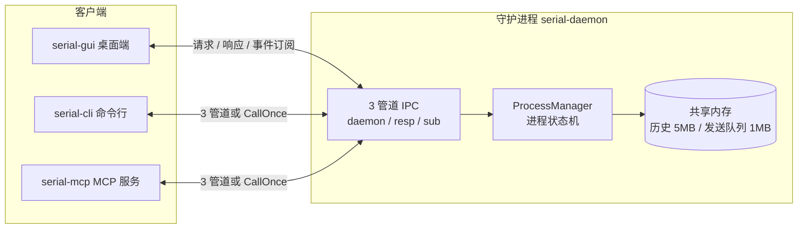

# serial-debugger — 跨平台串口调试工具 v0.6.5

[](LICENSE)

👋 欢迎使用 serial-debugger！如果它帮到了您，欢迎 **Star**；遇到问题请提交 **Issue**，有改进想法欢迎 **Pull Request**，任何反馈都是对我们的支持。

基于 **Go + Wails v2** 的跨平台串口调试工具：串口扫描与连接、文本/Hex 双模收发、定时自动发送、端口转发、设备探测、多标签页与历史持久化，一个工具覆盖串口调试全流程。

**架构亮点**

- **3 管道 IPC + 共享内存**：daemon/resp/sub 命名管道承载控制与事件订阅；共享内存环形缓冲区承载数据（历史 5 MB/进程、发送队列 1 MB/进程），发送走共享内存、IPC 仅触发。
- **守护进程 + 多客户端**：GUI / CLI / MCP 统一接入同一守护进程，ProcessManager 管理 idle/connected 状态与 single/forward 模式；心跳 5 s 一次，连续 3 次失败判定断连。
- **解码引擎 Go 化**：Go 端 per-tab goroutine 逐字节容错解码，产出 `[]Segment` 分段结构；前端纯 DOM 渲染（零 `innerHTML`），解码与渲染彻底解耦。

## 快速使用

> 📦 **下载**：最新构建产物见 [Releases](https://github.com/nienieai/serial-debugger/releases)（GitHub Actions 自动构建，解压即用；Windows 需已安装 WebView2 Runtime）。

> ⚠️ **使用须知**
> - **安全**：本工具当前无安全相关设计（无认证、加密、访问控制等），仅限在受信任的本地环境使用，请勿用于安全敏感场景——详见[安全说明](#安全说明)。
> - **翻译**：界面多语言由 AI 辅助翻译，可能存在不准确之处，欢迎提交修正——详见[国际化](#国际化)。

### GUI

1. 启动 `serial-gui.exe`（自动拉起守护进程）。
2. 点击「扫描」选择目标串口（如 `COM3`），设置波特率等参数，点击「打开」。
3. 在发送区输入数据，切换文本 / Hex 模式后点击「发送」；接收区实时回显。

### CLI

```bash
serial-cli start                # 启动守护进程
serial-cli ports                # 列出可用串口
serial-cli open COM3 115200     # 打开串口
serial-cli send "AT\r\n"        # 发送文本
serial-cli status               # 查看守护进程状态
serial-cli shutdown             # 关闭守护进程
```

> 不带参数进入交互 REPL，输入 `help` 查看全部命令；完整命令速查见 [CLI 速查表](CLI-CHEATSHEET.md)。

### MCP

`serial-mcp.exe` 作为 MCP 服务端通过 stdio 提供 JSON-RPC 2.0 接口，可接入支持 MCP 协议的客户端。

## 组成

| 可执行文件 | 说明 |
| --- | --- |
| `serial-daemon.exe` | 守护进程，单实例（互斥体），ProcessManager 管理 idle/connected 双状态 + single/forward 双模式 |
| `serial-gui.exe` | Wails v2 桌面客户端，多标签页，3 管道持久连接，纯事件驱动 |
| `serial-cli.exe` | 命令行工具，交互 REPL + 一次性命令，34 条命令（含 help） |
| `serial-mcp.exe` | MCP 协议工具，JSON-RPC 2.0 over stdio，28 个工具 |

### 架构一览



> 数据走共享内存（发送队列），IPC 承载控制与事件。历史上曾规划「客户端直接映射共享内存读取历史」，但该路径**从未接通**（`ringbuf.OpenSharedRing` 无调用点，且它只映射只读视图、返回对象上的读操作会写 tail，按原设计调用会崩），历史读取实际全部走 IPC 的 `session.history`。详见「已知限制」。

## 功能特性

### 串口核心

- 进程生命周期管理：idle ↔ connected 状态机，端口双向映射去重，显式销毁，断连保留
- 双模显示/发送（文本/Hex），独立缓冲区，单键切换
- 串口切换：连接中直接切换到其他端口，保留进程和历史
- 端口转发：绑定双串口双向透传，方向以 P1/P2 独立显示和统计
- 设备端口探测：TOML 规则配置，3 种匹配模式（substring / regex / modbus_crc），自动跳过已连接端口
- 流控支持：None / RTS/CTS / XON/XOFF

### 数据路径

- 发送走共享内存（1 MB/进程），IPC 仅触发
- 守护进程内置自动发送引擎：单条模式 + 多条目队列模式，运行中可修改
- 共享内存环形缓冲区（5 MB/进程），历史读取经 IPC 的 `session.history`（`Snapshot` 语义，读不消费）
- 历史持久化双写：环形缓冲区 + 磁盘文件同步追加

### 事件系统

- 订阅式推送：`rx` / `tx` / `1` / `2` / `send-error` / `ports-changed` / `process-changed` / `daemon-shutdown` / `stats-count` / `stats-rate` / `clients-changed` / `multistr-changed`
- 统计拆分：count（变化推送）+ rate（每秒推送），速率 ≥80% 橙色、≥90% 红色
- 订阅后立即推送当前状态

### 主题与外观

- **颜色主题**：文件驱动 + `_modes` 声明（dark/light 双模式），三段式色值（common/dark/light），CSS 全变量化，外部主题自动发现
- **图标主题**：内置 `config/icons/system/`（20 个 SVG），外部 `themes/icons/<名称>/` 文件夹格式，`_fallback` 回退
- **数据高亮自定义**：单端口 10 项 + 端口转发 9 项独立颜色设置，深浅色独立/统一，集成调色板（RGBA 滑块 + EyeDropper + 预设色板）
- **响应式设置页**：800 px 断点，宽屏左右分栏，窄屏导航悬浮覆盖层；搜索框内嵌图标
- **模糊渐变条**：config-bar / send-controls / settings-header / 转发按键栏统一透明 + 渐变模糊

### 前端架构

- 纯组件化标签页，`index.html` 仅保留 4 个结构元素，其余 JS 动态构建
- TabPage 独立 DOM 子树 + show/hide/destroy 生命周期，per-tab 完整状态
- 设置页独立标签页，侧边栏导航 + 气泡卡片布局
- Go 端 per-tab goroutine 解码，产 `[]Segment` 分段结构；JS `renderSegments()` 纯 DOM 渲染，零 `innerHTML`
- 空格和 CR/LF 可视化为标记（`·` / `←` / `↵`），`user-select: none` 保证剪贴板原样拷贝
- CSS 架构分层：`o-` 布局 / `c-` 组件 / `t-` 皮肤 / `is-` 状态

### 国际化

- 9 种语言（zh / en / ja / zh-Hant / ko / ar / ru / fr / es），含阿拉伯语 RTL
- 外部 i18n 文件覆盖内置翻译，`_font` 字段绑定语言首选字体

> **翻译说明**：多语言翻译由 AI 辅助生成，可能存在不准确、遗漏或语境偏差，欢迎提交修正（内置文件见 `config/i18n/`，外部覆盖见上方「配置」表）。

### 连接管理

- 双层断连检测：管道断裂即时检测 + 心跳兜底（5 s ping，连续 3 次失败判定断连）
- 状态栏三色气泡实时显示 GUI/CLI/MCP 连接数
- JS 侧 `_connecting` 互斥防重连风暴，Go 侧锁区合并 + 身份校验

## 安装与构建

### 下载

获取对应平台的构建产物压缩包，解压即用。Windows 需系统已安装 WebView2 Runtime。

### 从源码构建

```bash
# 在仓库根目录执行
go build -ldflags="-s -w" -o build/bin/serial-daemon.exe ./daemon/
go build -ldflags="-s -w" -o build/bin/serial-cli.exe    ./cmd/serial-cli/
go build -ldflags="-s -w" -o build/bin/serial-mcp.exe    ./cmd/serial-mcp/
wails build -devtools  # GUI，产物在 build/bin/
```

> 💡 **仅需命令行工具时**（无需 GUI），可直接用 `go install` 安装：
>
> ```bash
> go install github.com/nienieai/serial-debugger/cmd/serial-cli@latest
> go install github.com/nienieai/serial-debugger/cmd/serial-mcp@latest
> go install github.com/nienieai/serial-debugger/daemon@latest
> ```
>
> GUI（`serial-gui`）需 Wails 环境（`wails build`），完整构建矩阵见 [BUILD.md](BUILD.md)。

版本号统一维护在 `version/version.go`，改一处全部可执行文件同步。仓库已配置 [GitHub Actions 自动构建](.github/workflows/release.yml)：推送 `v*` 标签或手动触发即可产出各平台二进制并发布 Release。

## CLI 命令（34 条，含 help）

| 类别 | 命令 |
| --- | --- |
| 守护进程 | `start` `check` `status` `shutdown` |
| 端口 | `ports` `refresh` `probe [ports...] [--config]` |
| 进程 | `create` `declare` `open` `connect` `disconnect` `close` `switch` `setmode` `forward` |
| 数据 | `send [--hex]` `stats` `history` |
| 自动发送 | `autosend start/stop/status/interval` `sendqueue` |
| 多字符串 | `multistr save/load/reload/status` |
| 历史 | `history-files` `history-search` `history-enable` `history-status` `history-attach` `history-new` `history-detach` |
| 诊断 | `sessions` `monitor` `threads` `goroutines` |
| 其他 | `help` |

## MCP 工具（28 个）

`serial_start_daemon` `serial_list_ports` `serial_refresh_ports` `serial_create` `serial_open` `serial_connect` `serial_disconnect` `serial_switch` `serial_forward_create` `serial_declare` `serial_set_mode` `serial_close` `serial_send` `serial_sessions` `serial_history` `serial_status` `serial_monitor` `serial_shutdown` `serial_stats` `serial_port_watch` `serial_autosend_start` `serial_autosend_stop` `serial_autosend_status` `serial_sendqueue` `serial_multistr_save` `serial_multistr_load` `serial_multistr_status` `serial_probe_ports`

## 配置

| 位置 | 说明 |
| --- | --- |
| `config/probe.toml` | 设备探测规则（substring / regex / modbus_crc） |
| `config/themes/` | 颜色主题（`system.json` 内置，`_modes` 声明模式） |
| `config/icons/system/` | 内置图标主题（20 个 SVG + `icons.json`） |
| `config/i18n/` | 内置翻译（9 语言） |
| `themes/icons/<名称>/` | 外部图标主题（文件夹 = 主题，`_fallback` 回退） |
| 外部 i18n 文件 | 覆盖内置翻译，`_font` 字段绑定语言首选字体 |

## 文档

| 文档 | 说明 |
| --- | --- |
| [框架文档](ARCHITECTURE.md) | 架构设计、IPC 协议、进程生命周期、时序图 |
| [需求文档](REQUIREMENTS.md) | 需求列表与实现状态 |
| [构建文档](BUILD.md) | 环境要求、构建矩阵、产物说明 |
| [待办与已知问题](TODO.md) | 待实现功能、已知问题、版本完成记录 |
| [布局规则](LAYOUT-RULES.md) | 前端布局与 CSS 约束 |
| [贡献指南](CONTRIBUTING.md) | 提交规范、翻译贡献、行为准则 |
| [第三方许可](THIRD_PARTY_NOTICES.md) | 依赖许可证清单（MIT/BSD/Apache/ISC） |
| [CLI 速查表](CLI-CHEATSHEET.md) | 常用命令速查与示例 |

## 版本历史

### 0.7.4.2（2026-09-13）

补丁版，处理 v0.7.4.1 测试报告里仍未解决的那条**严重**问题。

- **注册握手失败现在会自动重试**。这份报告最重的一条是「并发下注册握手间歇失败」，本版先把它复现到可处置的程度：

  | 条件 | 次数 | 失败 |
  |------|------|------|
  | 串行 | 300 | 1（0.3%） |
  | **8 路并行 × 60 轮** | 480 | **42（8.8%）** |

  即它**只在并发建立会话时出现**，与报告测到的 9.3% 吻合。但报告推断的根因（客户端监听器未就绪）不成立——实测反驳有 5 条：① 守护进程日志显示该会话**已完成注册**（`已注册` 那行位于 `addSession` 内，而 `addSession` 在两条回连管道都成功之后），回连压根没失败；② 没有一条「连接客户端 resp/sub 管道失败」；③ 失败会话**未被驱逐**；④ 守护进程**没有写确认失败**（本版新增该日志后实测 0 次）；⑤ 报告说「失败指纹失效（三者计数相等）」实为统计方法问题——失败会话同样会打「已注册」，真正的指纹是「已注册但从未开始通信」，现已做成常驻错误日志。

  现场是矛盾的：守护进程侧写成功，客户端侧读 `daemonConn` 失败。指向 `pipe` 层并发下的句柄/缓冲竞态，**根因未定位**。因此本版采取重试：每次重试换**全新 clientId**（因而是全新管道名，不会踩上次残留），全部失败时错误里带尝试次数与原因，失败尝试仍在守护进程侧留日志。实测 **8.8% → 0.21%**（1/480），守护进程侧 506 次注册对 480 次成功会话，27 次失败尝试可见。这是对已知缺陷的缓解，不是修复——问题没有被藏起来。

- **顺带修掉两处由此暴露的缺陷**。① `connectOnce` 的 sub 管道失败/超时分支**漏关 `respLn`**：加了重试后，每次失败都会泄漏一个 listener 及其预建管道实例。② 握手失败的表达从「关闭 `earlyCh` 通道」改为「发送 `earlyResult{msg, err}`」——关闭通道会让 `select` 立刻返回，与错误信息的记录相互竞争，这正是定位过程中一度看不到真实错误的原因。

- **修正文档中一处过度承诺**。`操作说明.md` 原写「提示 IPC 协议版本不匹配：新旧程序混用（换过版本）」——这暗示**任何**版本混用都会被拦。实际机制是比对 `protocolVersion` 这一个整数：它只在**破坏性变更**时才改号，所以同为协议 1 的不同版本（如 0.7.4 与 0.7.4.2）是**设计上兼容、可以混用**的，不会也不应该报错。文档已改为准确表述，并提示混用极旧版本可能缺少新事件/新字段。

### 0.7.4.1（2026-09-12）

**0.7.4 的补丁版。** 内容与 0.7.4 完全一致（下一条），单独发版的原因是 0.7.4 的归档已在外部测试中流转，而这批修复包含对 `sendqueue` 输入校验与自动发送状态的改动——值得用一个可区分的版本号重新交付，避免「同名不同物」的混淆。

本版同时在 `操作说明.md` 中补上了 **`intervalMs` 与条目延迟 `delay` 的分工说明**（见下条最后一段），这正是外部测试报告把 queue 模式的 1000 ms 条目延迟误判成「`intervalMs` 不生效」的根源。

### 0.7.4（2026-09-12）

本版是**稳定性与可诊断性**版本：修掉一个会让整个守护进程静默退出的内存生命周期竞态、一个让「连不上」永远查不出原因的诊断黑洞，以及三处写了代码却从未生效的前端逻辑。

- **守护进程崩溃竞态（严重）**。`pm.Close()` 在释放 `pm.mu` 之后才拆共享内存，而 `Process` 指针是裸共享的（`Get` 拿到指针后就放锁）。于是读取方可能在环已被 `UnmapViewOfFile` 之后才去碰它——`GetHistory`/`ClearHistory` 会把快照/清零打在已撤销的映射上，`recordHistory` 会写已关闭的 fd。实测（`go test -race`）复现为 `WARNING: DATA RACE` 紧接 `unexpected fault address ... [signal 0xc0000005]`。危害之所以是大级别：dispatch 路径上**没有任何 `recover`**，而守护进程是机器级单例——它一崩，所有 GUI / CLI / MCP 会话与串口一起断。修法是让环的置空发生在保护它的锁内，使用方持锁后**重新判空**；发送环（`sendRing`）有同样的窗口，一并修掉（那边表现为对 nil 调方法而 panic）。`daemon/ringlife_test.go` 是并发回归测试，已做变异验证：还原修复即复现上述崩溃。
- **连不上时不再只有一句无信息量的超时**。守护进程回连客户端管道失败时，会把原因写在注册管道上（`daemon/ipc.go` 的三处错误分支），但客户端在等 `respCh` 的 5 秒里**从不读那条管道**，原因被丢弃。现在客户端在握手期间同时监听它，并且**单独为它设一个 select 分支**——因为回连失败时那条 resp 管道永远不会来，只在超时分支里顺手取一下的话，即使原因 0.5 ms 就到了，用户仍要干等满 5 秒。实测：修复前 2.0 s（测试用超时）+「守护进程未在 5 秒内回连 resp 管道」，修复后 0.3–1.5 ms + 守护进程给出的真实原因。
- **守护进程日志落盘（此前无人值守启动等于零日志）**。由客户端拉起的守护进程是 `--silent` 且 `Stdout`/`Stderr` 未重定向（`os/exec` 约定接到空设备），而 `logOp` 只做 `fmt.Printf`——于是守护进程侧的任何错误都没有任何地方能看到，这正是上一个问题难以定位的原因。现在日志双路输出到 `<exe>/logs/daemon.log`，新增 `serial-cli logs [n]` 可随时查看（**不需要守护进程在运行**，因为守护进程起不来时才是它最有用的时刻）。两个 Windows 细节：文件必须以共享模式打开（`os.OpenFile` 是独占的，否则守护进程一运行日志就没人读得到，而「它跑着的时候去看日志」正是唯一用途）；且必须用 `FILE_APPEND_DATA` 而不是 `GENERIC_WRITE`——`CreateFile(OPEN_ALWAYS)` 会停在偏移 0，第二个实例写「已在运行中」时会覆盖掉日志开头（实测留下一截被截断的旧行）。另外该消息现在同时落盘，不再只写 stderr。
- **三处前端逻辑从未生效**（均已在浏览器中实测确认）：① 状态栏速率告警产出 `rate-high`/`rate-warn`，而 CSS 只定义 `rate-orange`/`rate-red`，告警色永不出现；② 端口下拉的选中项加的是 `selected`，而 CSS 与 `scrollIntoView` 查的是 `is-selected`，选中高亮与自动滚动双双失效；③ 切换语言时只有第一个标签页的系统消息会刷新——`refreshSysMsgI18n` 用 `document.getElementById('displayContent')`，而每个标签页都发了同一个 id，该函数只拿到第一个。现按类名遍历全部页面。
- **`sendqueue` 不再静默吞掉写错的字段名**。此前 CLI 把文件解析成 `[]map[string]any` 再走 IPC，未知字段会被连丢两次（CLI 的 map 忽略一次、守护进程的 struct 再忽略一次），于是 `{"data":"ONE"}` 这类输入返回 `success:true, entries:1` 而实际装进去的是**空内容**——使用者直到发现什么都发不出去才知道字段名写错了。现于 CLI 侧用 `DisallowUnknownFields` 严格校验，报错里直接给出接受的字段名与示例；`data` 作为 `content` 的别名仍被接受，以兼容最常见的手误。同时解析前剔除 UTF-8 BOM——PowerShell 5.1 的 `Set-Content -Encoding UTF8` 会写 BOM，此前会报 `invalid character 'ï'`，用户完全看不出是自己文件的编码问题。
- **自动发送的三处状态问题**。① queue 模式在空队列时返回 `success:true` 然后一个字节不发、零告警，现象与「发送路径坏掉」无法区分，现改为明确报错；② `startAutoSend` 不复位计数器，上一轮留下的 `sendCount` 会原样出现在这一轮，现于启动时归零；③ `writePortSilent` 直接解引用 `p.port`，而空闲进程的 port 是 nil 接口——生产路径虽有 `status=="connected"` 守卫，但「自动发送跑到一半进程被断开」时循环仍会 tick，那一次解引用就是打崩整个守护进程的 nil panic（dispatch 无 `recover`、守护进程是机器级单例），现补 nil 守卫按普通发送失败计数。
- **关于第三方测试报告**：本版参考了一份外部 AI Agent 的全面测试报告。其中 `sendqueue` 静默容错、空队列空转、BOM、协议版本校验等结论已独立复测确认并修复；但报告列为 P0 的两条——「single 模式不发送数据、`sendCount` 虚报」与「`intervalMs` 不生效、恒定 1 条/秒」——**经本机实测证伪**：COM3→COM4 交叉互连、接收侧独立计数，`sendCount:21` 对应对端实收 21 块（3 字节/块），块间隔中位数 **0.201 s**（`intervalMs=200`）。报告测到的「约 1 秒节拍」实际是 queue 模式每条目自带的 1000 ms 延迟（`MultistrEntry.Delay`），与 `intervalMs` 是两个不同的量。报告列为「本轮最严重」的「注册握手 11% 失败」，本机反复复测为**偶发且远低于该比例**（120 次慢节奏 1 次；紧贴连跑 500 与 800 次均 0 次），且守护进程日志证明它**已经完成注册**（`addSession` 在两条回连管道都成功之后），故报告推断的「监听器未就绪」不成立；已改为不再把该情况断言成「守护进程拒绝了注册」。

### 0.7.3（2026-09-12）

本版以**快速面板布局**为主，另修复一处守护进程连接故障（详见下文最后一条，涉及 Go 侧改动）。

- **快速面板改为三段式布局，滚动条只覆盖数据行**。上一版把「+ 添加」做成表格最后一行后暴露出一个问题：`.qp-table` 既是定义列宽的网格、又是滚动容器，滚动条因此跨过了表头与添加行。现拆成 **表头 / 滚动区 / 添加行** 三段：`.qp-scroll` 成为唯一的滚动容器，滚动条被严格夹在表头下沿与添加行上沿之间（实测跨度 `217..889`，与两者完全重合）。代价是 `subgrid` 不能再用了——`subgrid` 的轨道来自母网格，不随滚动区自身的滚动条收窄，轨道会溢出到滚动条底下——所以表头与滚动区改为两个独立网格共享同一份**确定值**列模板 `--qp-cols`。列宽必须确定：用 `max-content` 时表头（文字）与行（控件）的固有尺寸不同，列会各自漂移，连 `1fr` 列宽也跟着变，实测宽面板下偏差可达 14px；改为定值后 enable / hex / delay / send 四列偏差为 0。
- **修复「先打开守护进程再打开 GUI 有时连不上」**。这个故障有两层根因：

  ① **守护进程的日志会阻塞它自己**。Windows 控制台开启「快速编辑模式」时，只要用户点击一下控制台窗口，控制台就进入选择状态，此时**进程往该控制台写输出会阻塞**（控制台标题会带上「选择」前缀）。而守护进程的日志是同步 `fmt.Printf`，日志一被卡住，正在处理连接的 `handleRegister` 就停在中途，客户端只能等到 5 秒超时。现于启动时调用 `SetConsoleMode` 关掉 `ENABLE_QUICK_EDIT_MODE`（须同时设置 `ENABLE_EXTENDED_FLAGS` 才生效），并在改动成功时记一条日志。

  ② **GUI 把一次启发式检查当成了连接的前提**。`CheckDaemonStatus` 在尝试 IPC 之前先用 `tasklist` 判断「守护进程是否在跑」，而那是启发式检查——被安全软件拦截、系统繁忙导致 `CreateProcess` 失败、或输出格式变化时都会返回 false，于是守护进程明明在等待，GUI 却连试都不试；而且该调用没有超时，一旦卡住会让 `a.checking` 永远停在 true，之后所有检查都直接返回 false（永久离线）。现改为直接拨 IPC：没有守护进程时 `WaitNamedPipe` 会立刻返回 `ERROR_FILE_NOT_FOUND`（`pipe.dialPipe` 的注释已说明），并不慢，而且是权威判据。同时给 `tasklist` 加 3 秒超时，`checkOffline` 也不再以它的结果决定是否尝试连接。
- **修复表头「延时(ms)」被截成「延时(…)」**。拆成独立网格后表头单元格宽度等于列轨道本身，而「延时(ms)」实测需 55px 内容宽（加内边距 4px 与右边框 1px 共 60px），44px 的轨道放不下，被 `.qp-col` 的 `overflow: hidden; text-overflow: ellipsis; white-space: nowrap` 截断。原来用 `subgrid` + `gap: 0` 时单元格实际宽度是「轨道 + 间隙」（54 + 6 = 60），正好放得下——所以这是拆分网格引入的回归。现把延时列定为 62px，并从内容列的最小值里补回（48 → 40），裁剪阈值仍约为 298px。
- **修复横向滚动条过粗**。全局规则只写了 `::-webkit-scrollbar { width: 6px }`，而 `width` 约束的是竖向滚动条；横向滚动条的粗细由 `height` 决定，未设置时回落到平台默认值（Windows 上十几像素）。现补为 `width: 6px; height: 6px`。
- **快速面板的横向滚动条恢复，但限定为 6px**。表头在滚动区之外，若只让数据行横向滚动，表头不会跟随、列会错位；因此 `.qp-hdr` 自身也横向可滚（滚动条隐藏），由 `tabpage.js` 的 `scroll` 监听同步 `scrollLeft`，横滚条只由 `.qp-scroll` 显示一条。实测横滚后列偏差与横滚前完全一致（最大 3.5px）。同时把各列最小宽度压到合计 `284px`，使触发横滚条的面板宽度约为 298px（内容列是 `1fr`，正常宽度下会自动撑开，观感不变）。实测：674 / 449 / 375 / 322 / 300px 下无横滚条，255px 时出现 6px 横滚条。
- **滚动条槽固定占位**。`.qp-scroll` 用 `scrollbar-gutter: stable` 让滚动条槽恒占 6px，`.qp-hdr` 右内边距相应取 `10px`（4 + 6）。这样滚动条出现/消失时不会有整列跳动——实测有/无滚动条两种状态下列偏差完全一致。
- **状态栏右侧改用「箭头 + Tx/Rx」**。原来各语言的 `stat.tx`/`stat.rx` 并不统一——中文是「发送/接收」、繁中「傳送/接收」、韩文「송신/수신」、阿拉伯文用词，而 en/ja/fr/es/ru 已经是 `Tx`/`Rx`；而且**根本没有箭头**，`.stat-arrow` 只是带颜色的文字标签（类名叫 arrow、内容是文字）。现统一为 `↾ Tx: 0` / `⇃ Rx: 0`，9 种语言的 `stat.tx`/`stat.rx` 都取 `Tx`/`Rx`。

  大小写取 **`Tx`/`Rx` 而非 `TX`/`RX`**：数据区每条记录的时间戳前缀是**硬编码**的 `history.js: 'Rx' / 'Tx'`（不走 i18n，各语言一致），而状态栏与数据区同屏显示，两处挨着的缩写必须同形；设置页的颜色预览同样用 `Rx ⇃` / `Tx ↾`。箭头则沿用项目既有约定：**TX = `↾`、RX = `⇃`**（同上两处），避免再造一套方向符号。
- **多字符串发送的「+ 添加」改为表格末尾的一行**。原来它是一个独立的页脚条（`.qp-footer`，带 `border-top`、自己占一行高度），与表格是分离的。现改为表格的最后一行（`.qp-add-row`），数据少时紧跟最后一条数据行之后（实测间距 0px）。原按钮带的 `.toggle-btn`（`display: inline-grid; width: max-content`）会阻止撑满整行，故不再使用。

`LAYOUT-RULES.md` §7 与速查索引已同步说明三段式结构、定值列模板与滚动条槽的对应关系。

验证：滚动条跨度在 3 / 14 / 60 行与窄/宽面板下均为「表头下沿..添加行上沿」；有/无滚动条时列偏差一致（最大 4px，四列为 0）；点击仍能新增行；无未捕获页面异常。

### 0.7.2（2026-09-12）

本版为**前端缺陷修复**，来自一次对 GUI 布局的系统性核对（几何测量 + 浅色/深色对照 + 逐条核对 `LAYOUT-RULES.md` 与实现）。前两项都是「代码写错了但不报错」的静默失效。

- **修复隐藏分支从未生效**（`applySendRatio()`）。原代码写 `style.overflow = 'is-hidden'`——把**类名**当成了 `overflow` 的值。CSSOM 对非法值静默忽略，所以 `sendRatio >= 0.97`（收起显示区）与 `<= 0.01`（收起发送区）两个分支从未执行过；面板只是被 flex 压到 0 高度，`sendRatio = 0.005` 时留下 4px 高的发送工具栏残条。改为 `classList.toggle('is-hidden', cond)`，转发模式分支一并清理该类。
- **修复浅色主题缺失 4 个语义色变量**。两个浅色变量块各定义 17 个变量，而深色块有 21 个，缺 `--accent` / `--green` / `--red` / `--yellow`。由于 `var()` 无 fallback 时属性会在 computed-value 阶段失效并回落到初始值，表现不是「颜色不对」而是**属性整体消失**：设置页 4 个开关处于「开」时轨道全透明 + 白圆点 = 完全不可见；此外状态栏在线点、标签活动点、速率告警色、端口占用标记，以及 `.cs-option.is-selected` / `.settings-*.is-selected` 等一批 `background: var(--accent); color: #fff` 的选中态都会变成白字透明底。已补齐为浅底可读的加深版本（`--accent` 取与既有 `--fwd-p1` 同色）。
- **修复清空按钮压住第一条数据行**。`.c-clear-btn` 底边在 76px（`top: 48px` + `height: 28px`），而 `.display-content` 只预留 74px，差 2px，实测重叠 48×2px。根因是悬浮条的预留空间由各处分别写死、没有单一来源，现引入 `--reserve-top`，`.display-content` 的 `padding-top` 与按钮的 `top` 都由它推导。
- **同步 `LAYOUT-RULES.md`**：补充三处与实现不符或未记录的说明——`.display-area` 的 `min-height` 实际由 JS 写为 40px；`.tabs-scroll` 的 `overflow-y: visible` 因 CSS 规范（一轴 `visible`、另一轴非 `visible` 时 `visible` 会被计算为 `auto`）无法生效，故「激活标签向下覆盖分隔线」实际不生效；`.o-divider--quick` 在面板折叠时保留是刻意设计（从右边缘把面板拖出来的手柄），不是残留。

另将 6 条未修项记入 `TODO.md`：类名前缀约定落实率仅 24%、响应式只有一个宽度断点（800px）、`z-index: 1` 被 4 个元素共用、标签栏横向滚动无视觉提示、`client`/`pipe` 层仍在产生误导性的 `daemon not running: ` 前缀等。

验证：`LAYOUT-RULES.md` 声明 vs 实测 45 项核对 **0 项不符**；GUI 端到端 **20/20** 通过且控制台无 error；浅色/深色下 4 个开关轨道分别为 `rgb(37,99,235)` / `rgb(76,194,255)`；清空按钮与首行重叠由 2px 降为 0。

### 0.7.1（2026-09-12）

本版为**平台支持**更新：守护进程、CLI、MCP 三个可执行文件现在可在 Linux 上构建并运行。Windows 行为不变。

- **新增 Linux 支持**。此前 `daemon/main.go` 直接 import `golang.org/x/sys/windows`，导致整个守护进程包只能在 Windows 上编译；共享内存也只有 Windows 命名映射一种实现。现按平台拆分为成对文件（`//go:build windows` / `//go:build !windows`）：管道改用 `$XDG_RUNTIME_DIR/serial-tool/` 下的 Unix 域套接字（目录 0700），共享内存改用 `/dev/shm` + `mmap(MAP_SHARED)`，控制台代码页与串口流控设置下沉到各自平台文件。`pipe.Addr` 由常量改为平台变量，并新增 `pipe.Endpoint(name)` 统一三处管道名构造。
- **修复共享内存打开路径误用声明长度**。非 Windows 实现最初按调用方传入的大小建立映射，而打开既有对象时调用方传的是 0，触发「声明的数据区超出映射长度」。现改用 `Fstat` 取真实文件大小，并且只在创建者进程退出时 `unlink`，避免误删其他进程仍在使用的映射。
- **文档新增平台相关代码约定**（`ARCHITECTURE.md` §13）。说明 Go 条件编译的**文件级**粒度、三条硬规则（`//go:build` 与文件名后缀是 **AND** 关系而非覆盖；后缀必须是合法 GOOS/GOARCH，`unix`/`other`/`posix` 都不是），7 对平台文件清单，以及用 `go list` 在各 GOOS 下核对实际参与编译的文件集这一排查手段。
- **新增 `.gitattributes` 固定 `eol=lf`**。此前换行符取决于各人机器上的 `core.autocrlf`（本机为 `true`），表现为 Windows 上 `gofmt -l .` 把全部 Go 文件报成未格式化、而 Linux 上干净。仓库内本就以 LF 存储，此文件只是把现状显式固定。
- `client/process_windows.go` 补上 `//go:build windows`：后缀本就隐式生效，此改动仅为与其余 13 个平台文件统一风格。

Linux 端到端验证（Ubuntu 22.04.5，socat 建立 PTY 回环）：11 个包全部构建通过；守护进程创建 `/run/user/1000/serial-tool/daemon.sock`；CLI 报 `{"version":"0.7.1","protocolVersion":1}`；两个会话分别打开 PTY 两端，A 发送的 `4C494E55582D302E372E30` B 字节级完整收到；共享内存创建→2 个对象（24+5 MB、24+1 MB），销毁→0。四个 GOOS（windows / linux / darwin / freebsd）下 `go list` 列出的文件集互斥且完整，无缺失、无重复符号。

### 0.7.0（2026-09-12）

本版以**稳定性与接口一致性**为主，未新增功能。五项修复各自都来自实测复现，而非代码审阅的推测。

- **修复广播阻塞：一个卡住的客户端会拖死整个守护进程**（严重度最高）。事件推送此前在持有会话锁的情况下逐会话同步写管道，而同步写管道在缓冲区满时会阻塞。实测：一个注册后停止读取事件的客户端，能让任何新客户端注册阻塞 **63～143 秒**（多次运行），阻塞时长等于该客户端的存活时长；期间该串口的读循环也停在原地丢数据。现改为每个会话一个写入协程 + 有界队列，广播只做非阻塞投递，慢客户端被单独摘除而不是让所有人承担代价。修复后同一场景 `status` 稳定在 66～125 ms。
- **引入 IPC 协议版本协商**。守护进程是机器级单例，而 GUI / CLI / MCP 是各自独立升级的可执行文件，「新客户端 + 旧守护进程」是常态。此前协议层没有任何版本概念，守护进程甚至无法报出自身版本；差异会静默落到数据层（例如多字符串条目格式不符时被降级成乱码并原样发给串口）。现在新增 `daemon.info` 方法，客户端建立会话后即刻核对协议版本，不匹配则明确报错；`serial-cli start` 会自动重启版本不一致的守护进程。
- **修复命名管道握手竞态**。管道实例原先在 `Accept()` 内部才创建，而调用方普遍是「Listen → `go Accept()` → 立刻向对端发消息」。若 Accept 的协程尚未被调度，对端会拿到 `ERROR_FILE_NOT_FOUND`，表现为高频率的「管道不可用」（实测连续调用 CLI 时约 80% 失败）。现在 `Listen` 返回前即创建实例，并使管道名在全生命周期内始终有实例可用。
- **加固共享内存**。`CreateFileMapping` 遇到同名对象会「成功」并返回既有 section 的句柄，此前会被静默复用，使两个无关进程共享同一块环形缓冲区；现已明确报错，并给环名加上守护进程实例令牌以杜绝撞名。头部布局版本字段此前只写不读，数据区大小则直接信任被映射内存自己声明的值，现均纳入校验。
- **引入 `contract` 包，把 IPC 方法面收敛为单一事实来源**。同一个方法名此前在六处各自以裸字符串重复声明，已产生实际漂移（`multistr.status` 这个不存在的方法名被 CLI 与 MCP 同时使用；`forward.create` 与 `process.create` 两条通道并存且参数名不同）。现在方法名是常量，改名会编译期报错，各层不可能再引用不存在的方法。

测试方面新增：`ringbuf` 与 `contract` 从零覆盖；`pipe` 增加握手竞态、取消在途 I/O、Close 不阻塞等回归测试；`daemon` 增加契约一致性与畸形参数边界测试。关键测试均做过变异验证（去掉被测逻辑后测试确实失败）。

### 0.6.5（2026-09-11）

- **修复 MCP stdio 分帧不符合规范**：`serial-mcp.exe` 改用换行分隔 JSON-RPC。原 Content-Length 分帧并非 MCP 传输格式，任何规范兼容的 MCP 客户端都完全无法与之通信（而服务器声明的是 `protocolVersion: 2025-06-18`）
- **修复无守护进程时 CLI 永久挂死**：`pipeListener.Close()` 原对挂起的 `ConnectNamedPipe` 依次调用 `DisconnectNamedPipe` 与 `CloseHandle`，二者都会等待该 pending I/O 完成，导致 `status` / `ports` / `sessions` / `shutdown` 等命令无限阻塞（>30 s 不返回）；改用 `CancelIoEx` 中止挂起 I/O
- **修复一次性 CLI 命令固定 4.1 s 开销**：源于同一 listener 关闭路径的自连接重试（40 × 50 ms × 2 个 listener），现降至约 60–80 ms
- **修复 `probe` 开箱不可用**：`probe.toml` 增加 `//go:embed` 内置回退；修正 `<exe>/../../config/probe.toml` 搜索路径（原 `../config` 在 `build/bin` 场景下指向 `build/config`，即 v0.6.4 声称的修复实际未生效）并去除重复候选
- **修复 CLI 用法错误静默退出**：非交互模式下参数错误此前零输出直接 exit 1，现打印用法提示后再退出
- **修复 `autosend stop` / `autosend status` 不带 pid 不可用**：参数校验由 `len(args) < 3` 改为 `< 2`，与帮助文本中 `[pid]` 可选一致
- **修复 `go test ./...` 整体无法运行**：`config.T` 的 args 改为切片参数，避免 `go vet` 将其判定为 printf wrapper、进而拒绝所有非恒定 key 的调用
- `ARCHITECTURE.md` / `BUILD.md` 中 MCP 分帧与 probe 搜索路径描述同步修正

### 0.6.4（2026-06-05）

- 修复 Hex 发送字节丢失：`DecodeEntryContentOnly` 误将 Modbus 首字节 0x01 判为 multistr 条目头，新增 flags/delay 校验防误判
- `send.trigger` IPC 新增 `raw` 参数：直接发送传 `raw:true` 跳过 multistr 解码，快捷面板传 `raw:false` 保持兼容
- 修复自动发送/多字符串逐条目延迟默认 1000 ms：改为跟随 `autoSendIntervalMs`，兜底 100 ms
- 修复 Hex 显示不跟随设置颜色：`.hex-data` 的 `color: var(--fg)` 覆盖方向颜色变量（`--dc-hexRx`/`--dc-hexTx` 等），移除冗余属性
- 修复启动后 TX/RX 显示模式初始状态不一致：`syncDaemonSessions` 新标签页改用全局 `state.displayMode` 初始值，激活时显式刷新按钮
- `findProbeConfig` 新增搜索路径 `<exe>/../config/probe.toml`（build/bin → config 开发场景）
- MCP ServerInfo 版本从硬编码 `0.5.9` 改为 `version.Version` 统一同步

### 0.6.3（2026-05-26）

- 数据路径重构：环形缓冲区从 Drain 消费模型改为 Snapshot 观察模型，客户端读取历史不清空缓冲区，多客户端独立读取
- 历史清空本地化：GUI 清空历史仅为本地视图操作，不通知 daemon，不清环形缓冲区和磁盘文件
- 上滚召回历史：清空后上滚从 daemon 环形缓冲区快照召回数据，超出范围翻磁盘文件（SearchHistory 分页+去重）
- 历史框左下角浮动按键栏重构：发送工具栏 RX/TX/发送格式切换按键合并到浮动栏，模式切换自动显隐
- 浮动栏按键样式统一：RX/TX 按键使用时间戳颜色（tsRx 绿/tsTx 蓝），P1/P2 保持端口颜色，Hex 模式实心背景
- 转发模式浮动栏精简为 [P1 文] [P2 文] | [锁定滚动]
- 非首个标签页多项修复：`_setSelectVal`/`getSerialConfig`/`openSerialPort`/`openForwardPorts` 改用 `pageEl` 活动页查询
- `_syncPortSelectsFromTab` 支持闲置声明进程写入端口/波特率
- `refreshStatsDOM` 无缓存时主动从 daemon 拉取统计

### 0.6.2（2026-05-26）

- 高亮颜色系统重构：所有项增加背景色+加粗+斜体设置，双层列标题
- 控制字符渲染改为子元素方案（`.ctrl-mark` 标记 + `.ctrl-real` 真实字符），Tab 用 `::after` 覆盖层不占流空间，换行保留正常高度
- 控制字符符号：空格 `·`、Tab `→`、CR `←`、LF `↵`、CRLF `←↵`，空格纳入可见控制字符开关
- 复制链路重写：`cloneContents()` + 显式 `\n` → `textContent`，标记不入剪贴板
- 发送框 IDE 化：透明 textarea 叠加镜像 div，控制字符实时可视化；Hex 模式下合法/非法字节分色
- 转义格式五选一：`/FF` `\xFF` `0xFF` `<FF>` `[FF]`
- Hex 解析增强：支持 `0x` 前缀、逗号分隔、无分隔连续字符串
- 状态栏重构：守护进程合并为按键；新增光标行列、制表符长度、行尾序列显示；统计颜色同步时间戳设置
- 设置页：编码格式/制表符长度/行尾序列合并为气泡卡片；字体大小统一上调；新增显示字体、行尾序列设置
- 发送按键和格式切换按键新增纸飞机图标；设置齿轮图标更新；新增 `reset`、`send` 内置图标
- 修复 `_refreshThemeNames` 变量遮蔽导致运行时错误；修复多标签输入框镜像不渲染

### 0.6.1（2026-05-25）

- 连接管理加固：重连互斥、锁区合并、身份校验、同 PID 会话清理
- 离线遮罩范围精确化，断连标签页完整清理
- 数据高亮颜色自定义：单端口 10 项、端口转发 9 项独立设置，深浅独立/统一，集成调色板
- 转发模式颜色键独立（ts1/ts2、text1/text2、hex1/hex2、fstat 等），默认值与单端口解耦
- 颜色设置 UI 重构：功能分组、列表式布局、列标题、色块 tooltip、预览 flex 并排
- 空格可视化：`·` 气泡标记，CR/LF 风格统一，剪贴板原样拷贝
- 模糊效果统一：所有浮动条改为透明 + 渐变模糊（blur 5 px + mask-image，3/4 全模糊）
- 设置页响应式：800 px 断点，宽屏分栏窄屏悬浮覆盖，搜索内嵌放大镜和清空叉
- 图标扩展：新增 `menu.svg`
- 日语/文言文完整重译，外置语言 pt/lzh 恢复
- 菜单栏、颜色主题卡片、关于内容、状态栏、下拉框等多项 UI 修复和优化

### 0.6.0（2026-05-24）

- 解码引擎迁移至 Go：逐字节容错解码，产分段结构交前端纯 DOM 渲染
- 前端架构重构：精简 HTML，TabPage 独立 DOM 子树 + per-tab 状态，弹窗全部 JS 化
- 设置页重构：独立标签页，左右分栏，新增关于面板
- 标签栏水平滚动，内置图标文件化（17 SVG），版本号统一

### 0.5.9（2026-05-20）

- 主题系统重构：文件驱动 + 三段式色值 + CSS 全变量化
- 发送框工具栏：三按键分立 + `data-icon` 声明式图标 + 水平滚动
- 多字符串面板图标化 + 循环发送

### 0.5.8（2026-05-19）

- 多字符串发送引擎：daemon queue 升级为多条目引擎（逐条延迟 + 循环 + 启用控制）
- CLI/MCP 扩展 sendqueue 和 multistr 命令族

### 0.5.7（2026-05-18）

- 前端 CSS 架构分层（o-/c-/is-/t- 命名前缀）
- 多字符串面板 CSS Subgrid 重构，JS 拆分为 4 模块

### 0.5.6（2026-05-18）

- i18n 键值补全，9 语言全翻译；波特率下拉框支持自定义数值输入

### 0.5.5（2026-05-18）

- 历史持久化双写：环形缓冲区 + 磁盘文件；历史搜索与召回；自动保存开关
- 完整 9 语言专业化重译，外部 i18n `_fallback` 回退

### 0.5.4（2026-05-17）

- 多 GUI 同步广播，流控支持（RTS/CTS、XON/XOFF）
- 设置文件改为 INI 格式，阿拉伯语 RTL 布局，DevTools 集成

### 0.5.2（2026-05-14）

- 菜单栏 SVG 图标 + 悬浮窗，主题按键 SVG mask-icon，端口转发交换按键

### 0.5.1（2026-05-14）

- 编码格式全局设置（ASCII/GB2312/UTF-8），容错解码引擎，Hex 显示样式独立配置，消息去重

### 0.5.0（2026-05-14）

- 客户端列表推送 `clients-changed`，状态栏三色气泡，设置持久化

### 0.4.9（2026-05-08）

- 统一进程模型：Process 新增 mode 字段（single/forward），进程模式切换

### 0.4.8（2026-05-08）

- 设备端口探测：TOML 规则配置，3 种匹配模式（substring/regex/modbus_crc）

### 0.4.7（2026-05-07）

- 端口转发 + 串口切换，GUI 标签页拖拽排序

### 0.4.6（2026-05-06）

- 自动发送成为守护进程功能，stats 拆分 count/rate，文本/Hex 独立发送缓冲区

### 0.4.5（2026-05-06）

- stats 事件速率推送，状态栏实时字节统计，循环发送

### 0.4.4（2026-05-05）

- Hex 发送支持空格分隔，历史缓冲区统一 5 MB，管道断裂即时检测

### 0.4.3（2026-05-05）

- 3 管道 IPC 架构（请求/响应/事件分离），心跳替代轮询

### 0.4.2（2026-05-05）

- 单持久管道，订阅式事件推送，空闲进程管理

### 0.4.1（2026-05-04）

- 进程生命周期重构，双状态机 + 端口去重，共享内存环形缓冲区

### 0.4.0（2026-05-04）

- 异步发送通道 + 硬件自动探针，会话 I/O 统计

### 0.3.x

- CLI 独立可执行文件，MCP 协议支持，Wails v2 框架，Windows 命名管道 IPC

### 0.2.x

- Go 重写替代 Node.js，WebView 桌面窗口，前后端分离

### 0.1.0（2026-05-01）

- Node.js 后端，Express + Socket.IO，Go WebView 桌面启动器

## ⚠️ 安全说明

> **本工具当前无安全相关设计**：不包含认证、授权、加密、访问控制或审计日志等安全机制；串口收发内容与历史记录以明文形式处理与存储。仅限在受信任的本地环境使用，请勿在不可信网络或安全敏感场景中部署。

## 贡献与许可

- 本项目基于 [MIT License](LICENSE) 开源，欢迎社区贡献——见 [贡献指南](CONTRIBUTING.md)。
- **AI 辅助声明**：本项目在开发与文档维护过程中使用了 AI Agent 工具辅助（代码生成与审计、文档润色、多语言翻译等）；文档与翻译内容由 AI 辅助产出，可能存在错误或不准确之处，欢迎指正与贡献修正。
