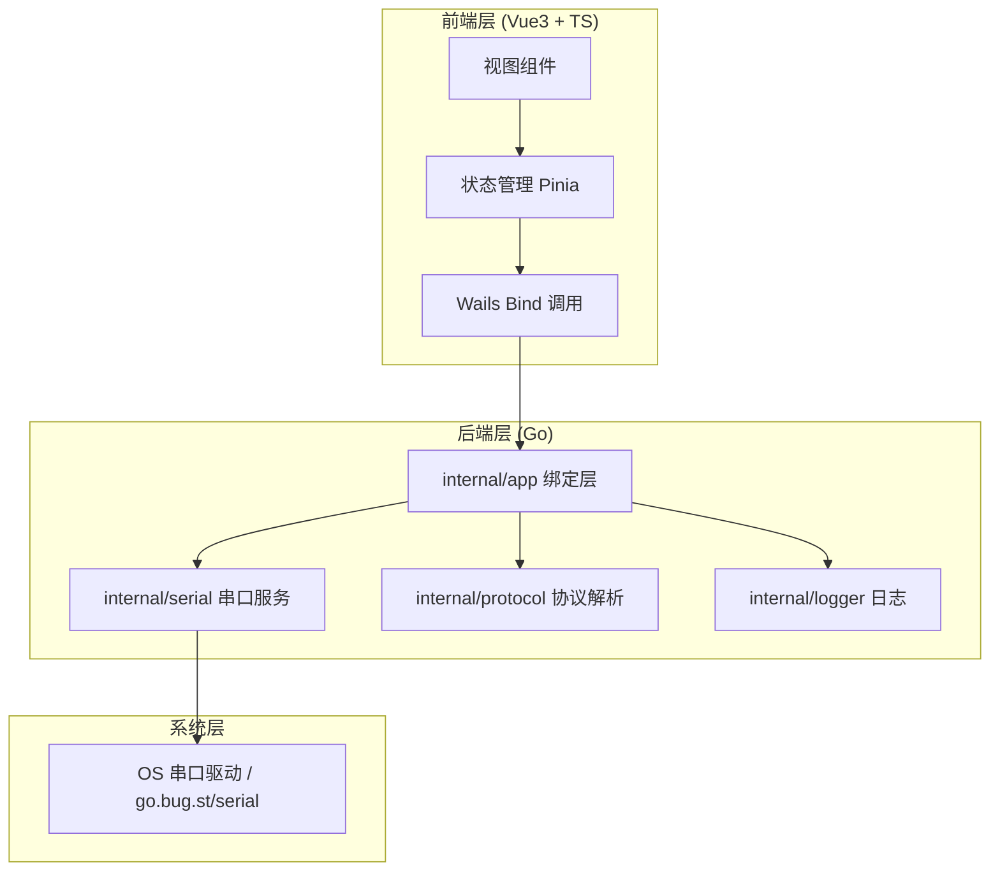
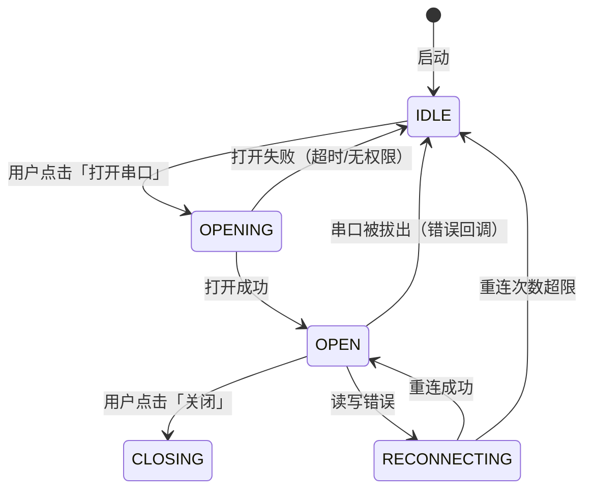
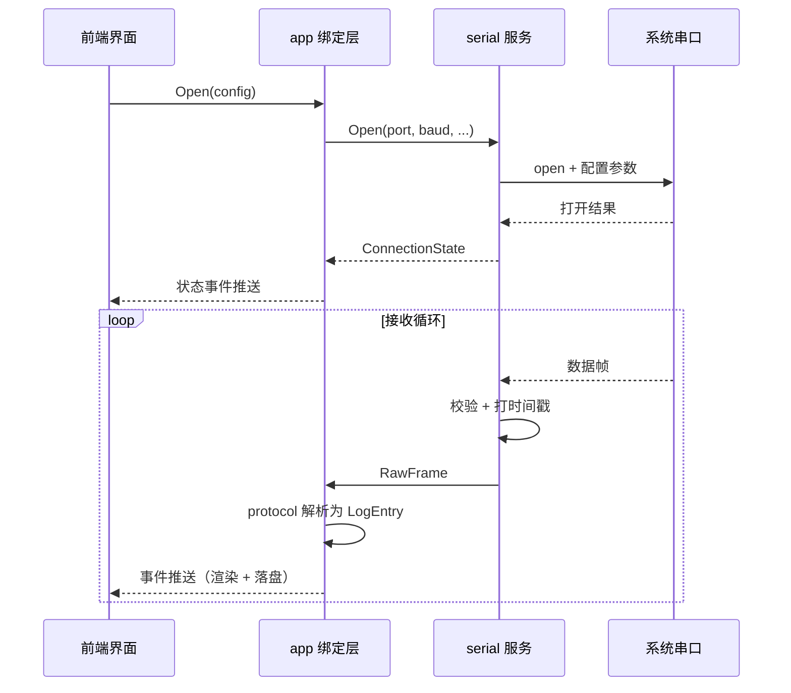

# 《文档风格指南》——Go + Wails 跨平台串口调试工具

> 适用对象：本仓库所有文档的作者（README、构建文档、架构文档、FAQ、贡献指南等），尤其是后续各阶段自动生成文档的 Agent。
> 本指南是各文档产出 Agent 的**唯一风格依据**：先读本指南，再写文档；写完对照第 6 节检查清单自检。

---

## 0. 调研依据摘要（为什么这样定规则）

本指南参考了以下知名开源项目的文档实践（2025 年调研）：

| 项目 | 借鉴点 |
| --- | --- |
| [Wails（wailsapp/wails）](https://wails.io/) | ① README 结构：居中 Logo + 徽章 + 一句话定位 + 功能列表 + 截图 + 快速开始 + 贡献 + 许可证；② 文档站分层：Getting Started → Reference → Guides → Tutorials，读者分层清晰；③ 单独维护 [DEVELOPER_GUIDE.md](https://github.com/wailsapp/wails/blob/docs-redesign/DEVELOPER_GUIDE.md) 与 [CONTRIBUTING.md](https://github.com/wailsapp/wails/blob/master/CONTRIBUTING.md) 指导开发者；④ 维护 [中文 README 翻译](https://raw.githubusercontent.com/wailsapp/wails/v2.7.1/README.zh-Hans.md)，说明「README 简短 + 深度内容外链到 docs」的分工模式可行且受欢迎。 |
| [GitHub CLI（cli/cli）](https://github.com/cli/cli) | ① README 极简：徽章只保留少数关键项（版本、构建状态、许可证），不堆徽章；② 「安装」按平台分小节，每小节一个可直接复制的命令块；③ 「Documentation」节只给链接（manual 站点），不在 README 里写长教程；④ [CONTRIBUTING.md](https://github.com/cli/cli/blob/v2.65.0/.github/CONTRIBUTING.md) 独立成文，包含编码规范与开发环境；⑤ 命令示例统一用带 `$` 提示符的代码块，方便读者辨别哪些行是输入。 |
| [charmbracelet/bubbletea](https://github.com/charmbracelet/bubbletea) | ① 顶部用一句有辨识度的 tagline（"The fun, functional and stateful way to build terminal apps"）代替长篇介绍；② 大量 GIF 动图演示，一图胜千言；③ 功能用短 bullet 分组罗列，不写长段落；④ Usage 给**完整可运行示例**而非片段；⑤ 结尾固定 Related projects + License；⑥ 语气轻松但不失信息密度。 |
| 通用最佳实践（[GitHub README 指南](https://mdkit.io/blog/github-readme-guide)、GitHub 官方 Markdown 文档） | ① README 是「门面」，读者 10 秒内决定是否继续看；② 每个文档只服务一类读者（用户 / 贡献者 / 维护者），不混写；③ 代码块必须标注语言，保证语法高亮；④ 表格用于「对比 / 参数 / 矩阵」，列表用于「枚举 / 步骤 / 要点」，各司其职；⑤ 标题层级克制（≤3 级），避免目录混乱。 |

**三条贯穿性结论**（本指南所有规则的来源）：

1. **读者分层**：README 面向「用户」，构建文档面向「构建者」，架构文档面向「贡献者/维护者」。同一内容只在最合适的文档出现一次，其余地方给链接。
2. **短门面、深内容**：README 控制篇幅，深度内容放 `docs/` 目录，README 只留入口链接。
3. **图优于字，表优于段**：界面展示用截图/GIF，流程用 mermaid 图，参数对比用表格，功能罗列用列表。

---

## 1. README 结构（README.md）

### 1.1 总则

- 篇幅控制在 **150～250 行**。超过即视为「门面臃肿」，把内容下沉到 `docs/`。
- 只写「用户需要知道的事」，不写实现细节、不写开发流程（开发流程在 `docs/build.md`）。
- 全仓**只有一个** README.md（仓库根目录）；`docs/` 下不再放第二个 README 正文，只放索引 `docs/README.md`（可选）。

### 1.2 标准骨架模板（直接复制使用）

```markdown
<!-- ========== 1. 徽章区（可选，最多 5 个） ========== -->
<p align="center">
  
</p>

<p align="center">
  <!-- 徽章用 shields.io；只放有意义的：构建状态、版本、Go 版本、许可证 -->
  /<repo>?color=blue" alt="Release"/>
  /<repo>/ci.yml" alt="CI"/>
  
  
</p>

<!-- ========== 2. 一句话简介 + 架构亮点 ========== -->
# SerialTool — 跨平台串口调试工具

基于 **Go + Wails** 的跨平台串口调试工具：扫描与打开任意串口、HEX/ASCII 双模收发、
定时发送与日志归档，一个二进制搞定 Windows / macOS / Linux。

**架构亮点**：Go 后端驱动串口，前端（Vue 3 + TypeScript）渲染界面，两者通过 Wails
类型安全绑定通信；协议解析与 UI 完全解耦，可独立测试与复用。

<!-- ========== 3. 功能特性（分组列表，禁止长段落） ========== -->
## 功能特性

**串口管理**
- 自动扫描并列出系统全部串口（含 VID/PID、描述信息）
- 支持 波特率 / 数据位 / 停止位 / 校验位 / 流控 全参数配置
- 热插拔检测与自动重连

**数据收发**
- HEX 与 ASCII（UTF-8）双模式收发，支持混发
- 定时发送（周期可配）、多行发送队列
- 收发日志实时滚动显示，可暂停/清空

**日志与导出**
- 收发日志落盘（TXT / CSV），支持按时间轮转
- 会话快照保存与恢复（json 配置）

**工程化**
- 单二进制分发，无运行时依赖（Windows 需系统 WebView2）
- 深色/浅色主题、多标签页会话

<!-- ========== 4. 截图/GIF（占位，必须保留占位说明） ========== -->
## 界面预览

<!-- TODO(截图): 主界面全屏截图，1280x800，见 docs/images/main.png -->


<!-- TODO(GIF): 演示 打开串口→HEX 发送→接收回显，见 docs/images/demo.gif -->


> 截图/GIF 未就绪时**保留本节占位**，禁止删节；每张图配一句 alt 描述，图片文件名与
> 说明一一对应（见 `docs/images/README.md` 的图片清单）。

<!-- ========== 5. 快速开始（下载 / 构建 / 运行 三小节） ========== -->
## 快速开始

### 下载（推荐）

从 [Releases](https://github.com/<owner>/<repo>/releases) 下载对应平台的压缩包，
解压后直接运行：

```bash
# Windows: 解压后双击 serialtool.exe
# macOS:   chmod +x serialtool && ./serialtool
# Linux:   chmod +x serialtool && ./serialtool
```

### 从源码构建

```bash
git clone https://github.com/<owner>/<repo>.git
cd <repo>
wails build           # 产物在 build/bin/ 下
```

> 环境要求与按平台构建详见 [构建/开发文档](docs/build.md)。

### 运行

```bash
./build/bin/serialtool        # Linux / macOS
build\bin\serialtool.exe      # Windows
```

<!-- ========== 6. 使用示例（给 1～2 个核心场景，别写教程） ========== -->
## 使用示例

**场景：连接串口并发送一条 HEX 帧**

1. 启动后点击「扫描」，选择目标串口（如 `COM3` / `/dev/ttyUSB0`）。
2. 设置波特率 `115200`、数据位 `8`、校验位 `None`，点击「打开」。
3. 切换输入模式为 `HEX`，输入 `01 03 00 00 00 0A`，点击「发送」。
4. 接收区出现设备回帧即连接成功。

命令行无交互接口，全部功能通过图形界面完成；自动化场景可参考
[docs/protocol.md](docs/protocol.md) 的协议说明。

<!-- ========== 7. 文档链接（只放链接，不贴内容） ========== -->
## 文档

| 文档 | 说明 |
| --- | --- |
| [构建/开发文档](docs/build.md) | 环境要求、构建矩阵、调试方法 |
| [架构文档](docs/architecture.md) | 分层结构、数据流、状态机、关键参数 |
| [常见问题 FAQ](docs/faq.md) | 高频问题与解决 |
| [贡献指南](CONTRIBUTING.md) | 如何提交 issue / PR |

<!-- ========== 8. 贡献指南（简短 + 外链） ========== -->
## 贡献

欢迎提交 issue 与 PR。开发环境搭建、编码规范、提交流程见
[贡献指南](CONTRIBUTING.md)。

<!-- ========== 9. 许可证 ========== -->
## 许可证

[MIT](LICENSE) © 2025 <owner>
```

### 1.3 每节的硬性规则

| 节 | 规则 |
| --- | --- |
| 徽章区 | **可选**，最多 5 个；只放「构建状态、最新版本、Go 版本、许可证、Star 数」这类信息型徽章；不放炫技徽章（如代码行数、Twitter 关注）。链接用 shields.io。 |
| 一句话简介 | ≤ 2 句。句式：**「基于 X 的 Y：能做什么，一句价值主张。」** 不用「简单」「强大」「高效」等无信息量形容词。 |
| 架构亮点 | ≤ 3 条 bullet，讲「技术选型为什么这样搭」，面向技术读者；普通用户看不懂也**不影响**其使用 README 其他部分。 |
| 功能特性 | **分组列表**（每组一个 `**粗体组名**` + 3～6 条 bullet）；每条 ≤ 20 字，动词开头（扫描、支持、自动、可…）；禁止一条功能写一段话。 |
| 界面预览 | 截图 ≥1 张 + GIF ≥1 个（占位允许）；图片必须真实存在或标注 `TODO`，禁止放占位色块图；alt 必填。 |
| 快速开始 | 固定三小节：下载 → 构建 → 运行；命令块可复制即用；跨平台差异用注释行标注（`# Windows: ...`）。 |
| 使用示例 | 1～2 个真实场景，**步骤列表** + 可复制的输入/输出；不给完整教程，教程属于文档站。 |
| 文档链接 | 用**表格**列文档；每行「链接 + 一句话说明」。 |
| 贡献指南 | ≤ 5 行正文 + 指向 `CONTRIBUTING.md` 的链接。 |
| 许可证 | 一行：`[MIT](LICENSE) © <年份> <作者/组织>`；文件必须真实存在。 |

---

## 2. 构建/开发文档结构（docs/build.md）

### 2.1 总则

- 面向「构建者」：能照着文档把项目从零构建、运行、调试起来。
- 篇幅 **80～150 行**，以命令块和表格为主。
- 本仓库唯一负责「怎么构建」的文档；README 中只放一行命令 + 链接。

### 2.2 标准骨架模板

```markdown
# 构建与开发

<!-- ========== 1. 环境要求（表格） ========== -->
## 环境要求

| 工具 | 最低版本 | 用途 | 备注 |
| --- | --- | --- | --- |
| Go | 1.21+ | 后端编译 | 检查：`go version` |
| Node.js | 18 LTS+ | 前端构建 | 检查：`node -v` |
| Wails CLI | v2.x | 脚手架与构建 | `go install github.com/wailsapp/wails/v2/cmd/wails@latest` |
| 原生工具链 | 平台相关 | 原生编译 | Windows: TDM-GCC / MinGW-w64；macOS: Xcode CLT；Linux: gcc + libgtk-3-dev、libwebkit2gtk-4.0-dev |

> 首次安装后先运行 `wails doctor` 自检，它会列出缺失依赖及修复指引。

<!-- ========== 2. 快速构建（一次性成功路径） ========== -->
## 快速构建

```bash
git clone <repo-url> && cd <repo>
go mod download        # 拉取 Go 依赖
wails doctor           # 自检环境（可选但推荐）
wails build            # 构建当前平台
# 产物: build/bin/<可执行文件>
```

<!-- ========== 3. 按需构建矩阵（表格） ========== -->
## 按需构建矩阵

| 场景 | 平台 | 命令 | 产物 |
| --- | --- | --- | --- |
| 日常开发 | 当前平台 | `wails dev` | 热重载 + 前端调试端口 |
| 正式发布 | Windows amd64 | `wails build -platform windows/amd64 -clean` | `build/bin/serialtool.exe` |
| 正式发布 | macOS arm64 | `wails build -platform darwin/arm64 -clean` | `build/bin/serialtool` |
| 正式发布 | macOS amd64 | `wails build -platform darwin/amd64 -clean` | `build/bin/serialtool` |
| 正式发布 | Linux amd64 | `wails build -platform linux/amd64 -clean` | `build/bin/serialtool` |
| 仅编译后端（CI 快速校验） | 当前平台 | `go build ./...` | 无 UI，仅校验编译 |
| 仅跑后端单测 | 当前平台 | `go test ./internal/...` | 测试报告 |

> 规则：矩阵行按「场景」分组排序；同一场景的多平台行相邻；每行「命令」必须可直接复制。

<!-- ========== 4. 产物说明（表格） ========== -->
## 产物说明

| 产物路径 | 说明 | 分发要求 |
| --- | --- | --- |
| `build/bin/serialtool(.exe)` | 主程序，单文件 | Windows 需目标机装有 WebView2 Runtime |
| `build/bin/resources` | 打包进二进制的图标/资源 | 无需单独分发 |
| `frontend/dist` | 前端编译产物（构建中间态） | 不进 Release |

<!-- ========== 5. 开发调试（常用调试手法） ========== -->
## 开发调试

**后端（Go）调试**

```bash
wails dev          # 前端热重载 + 后端每次保存自动重启
```

- 后端日志走标准 `log`，`wails dev` 终端可见；关键路径（打开/关闭/收发）建议加
  DEBUG 级日志，用 `SERIALTOOL_DEBUG=1` 环境变量开启。

**前端（Vue/TS）调试**

- `wails dev` 默认在 `http://localhost:5173` 起 Vite 服务，浏览器 DevTools 直接可用；
  生产模式下载页面在 `http://localhost:34115`。
- 断点调试：后端用 IDE 的 Go 调试器附加到 `wails dev` 进程即可。

**串口相关调试**

- 没有真实串口时，用系统虚拟串口对（如 Windows 的 com0com、Linux 的 socat）联调：
  ```bash
  # Linux 示例：创建虚拟串口对
  socat -d -d pty,raw,echo=0 pty,raw,echo=0
  ```

<!-- ========== 6. 常见问题（高频 3～5 条，其余进 faq.md） ========== -->
## 常见问题

| 问题 | 解决 |
| --- | --- |
| `wails doctor` 提示缺 WebView2 | Windows 下载并安装 Evergreen WebView2 Runtime |
| Linux 构建报缺 gtk/webkit 头文件 | `sudo apt install libgtk-3-dev libwebkit2gtk-4.0-dev` |
| 打开串口返回 `permission denied` | Linux 将用户加入 `dialout` 组：`sudo usermod -aG dialout $USER` |

> 完整 FAQ 见 [docs/faq.md](faq.md)。
```

### 2.3 硬性规则

- 环境要求、构建矩阵、产物说明 **必须用表格**；调试步骤用列表/命令块。
- 每个命令块必须包含「命令 + 注释或下一行说明产物/效果」；命令用 `$` 提示符前缀（便于读者分辨输入/输出）。
- 矩阵中同一命令的变体（平台/架构）只差参数时，**不拆多行**，用一行列全。
- 产物说明必须写明「是否需要随 Release 分发」，避免打包遗漏。

---

## 3. 架构文档写法（docs/architecture.md）

### 3.1 总则

- 面向「贡献者/维护者」，回答三个问题：**代码在哪、数据怎么流、状态怎么变**。
- 篇幅 **200～400 行**；图（目录树 + 分层图 + mermaid）约占 1/3 篇幅，禁止纯文字描述结构。
- 与代码保持同步：每次改动目录/数据结构/时序，必须同步更新本节。

### 3.2 标准骨架模板

```markdown
# 架构设计

> 读者对象：贡献者。阅读前请先完成 [docs/build.md](build.md) 的环境搭建。
> 修订记录：本文件随代码变更同步更新，更新人负责同步。

## 1. 目录结构

```text
serialtool/
├── cmd/serialtool/          # 程序入口：组装依赖、启动 Wails
├── internal/
│   ├── app/                 # Wails 绑定层：暴露给前端的方法（Bind 接口）
│   ├── config/              # 配置读写（json 持久化）
│   ├── serial/              # 串口驱动封装：扫描/打开/读写/热插拔
│   ├── protocol/            # 协议解析：HEX/ASCII/自定义帧，纯逻辑可单测
│   └── logger/              # 收发日志：内存环形缓冲 + 落盘轮转
├── frontend/src/
│   ├── components/          # UI 组件（只负责渲染与交互）
│   ├── stores/              # 前端状态（Pinia）
│   └── views/               # 页面
├── docs/                    # 本文档等
├── build/                   # Wails 构建资源（图标等）
├── wails.json               # Wails 项目配置
└── go.mod
```

> 目录树规则：只列**有架构意义**的目录与文件；叶子文件过多时用 `…` 省略；
> 每个目录一行注释说明职责；注释以 `#` 对齐。

## 2. 分层架构



**分层职责**（依赖只能自上而下，禁止反向）：

| 层 | 职责 | 禁止事项 |
| --- | --- | --- |
| 前端层 | 渲染、交互、状态展示 | 禁止直接读写串口 |
| 后端绑定层 | 参数校验、调用编排 | 禁止包含业务解析逻辑 |
| 服务层 | 串口生命周期、协议解析、日志 | 禁止依赖前端类型 |
| 系统层 | 操作系统串口抽象 | 无 |

## 3. 连接状态机



> 状态机规则：每个状态一个**事件**触发迁移；错误路径必须画全（进入与退出都画）；
> 图中状态名与代码枚举一一对应（`internal/serial/state.go`）。

## 4. 数据流（收发时序）



**数据流关键点**（每条一行）：

- 接收方向：OS → serial → protocol 解析 → 前端事件 → 界面与日志双写。
- 发送方向：UI 提交 → 参数校验 → 编码（HEX/ASCII）→ 串口写入 → 回写日志。
- 所有跨层传递用**值类型 + 事件**，禁止共享可变全局状态。

## 5. 关键数据结构

| 结构体 | 关键字段 | 说明 |
| --- | --- | --- |
| `serial.Config` | `Port, BaudRate, DataBits, StopBits, Parity, FlowControl` | 打开串口的完整参数（前端表单直接映射） |
| `serial.ConnectionState` | `Status, Port, Err` | 状态机当前值，用于 UI 展示 |
| `protocol.Frame` | `Timestamp, Direction, Payload, Mode` | 一条收发记录（前端渲染与落盘共用） |
| `protocol.SendTask` | `Interval, Payload, Repeat, Enabled` | 定时发送任务 |
| `logger.Rotator` | `MaxSize, CurrentSize, Path` | 日志轮转控制 |

## 6. 关键超时与参数

| 参数 | 默认值 | 单位 | 说明 | 位置 |
| --- | --- | --- | --- | --- |
| 打开串口超时 | 2000 | ms | 打开失败判定 | `internal/serial` |
| 读取超时 | 100 | ms | 无数据时的轮询间隔 | `internal/serial` |
| 最大重连次数 | 3 | 次 | 超过进入 IDLE | `internal/serial` |
| 接收缓冲区 | 4096 | 字节 | 单帧上限 | `internal/protocol` |
| 日志轮转阈值 | 5 | MB | 超限自动滚动 | `internal/logger` |

> 参数表规则：必须有「默认值」「单位」「说明」三列；「位置」列指向代码位置，
> 便于读者直接改代码确认；值只写一处（代码常量），文档只描述不重复定义。

## 7. 关键流程（构建到发布的简图，可选）


```

### 3.3 mermaid 使用规范

| 场景 | 图类型 | 要求 |
| --- | --- | --- |
| 状态迁移 | `stateDiagram-v2` | 状态名用常量风格（`IDLE`），与代码枚举一致；错误迁移必须画全 |
| 跨模块调用 | `sequenceDiagram` | 参与者用「层名 + 模块名」；循环用 `loop` 块；关键返回值画虚线 `-->>` |
| 分层/流程 | `flowchart TD` | 节点标签用 `[方括号]` 文字；子图用 `subgraph` 分组 |
| 数据流 | `sequenceDiagram` 或 `flowchart LR` | 标注方向箭头（接收/发送）；每个箭头一行注释 |

- 所有 mermaid 图必须通过 [mermaid.live](https://mermaid.live) 语法校验后再提交。
- 每张图后必须跟 1～5 行文字**要点总结**（图是给人看的，文字要点给搜素与引用用）。

---

## 4. 表格 / 列表 / 代码块规范

### 4.1 何时用表格，何时用列表（决策规则）

| 内容类型 | 用表格 | 用列表 |
| --- | --- | --- |
| 多属性对象（配置项、参数、字段） | ✅ 每行一个对象，每列一个属性 | ❌ |
| 对比（平台差异、方案权衡、新旧行为） | ✅ 一列一个对比维度 | ❌ |
| 矩阵（平台×命令、版本×特性） | ✅ | ❌ |
| 步骤型流程（安装步骤、操作步骤） | ❌ | ✅ 有序列表 |
| 枚举/要点（功能列表、注意事项） | ❌ | ✅ 无序列表 |
| 单一维度取值（支持的波特率清单） | ❌ | ✅ |

**一句话规则：有「多属性对比」就用表格；是「顺序或枚举」就用列表。** 同一文档内同一类内容（如参数）必须统一用一种形式，不得混用。

表格细节：

- 表头必须写清单位与类型：`| 超时 | 默认值 | 单位 | 说明 |`，禁止把单位塞进数值（`2000ms` 写成 `2000 | ms`）。
- 对齐：表格列对齐可省略（GitHub 自动左对齐）；数值列建议右对齐 `---:`。
- 表格单元格内禁止放长段落（> 40 字请拆行或改写为列表）。
- 空值写 `-`，不写 `无`、`N/A` 混用（全文档统一用 `-`）。

### 4.2 代码块语言标注

- **每个围栏代码块必须标注语言**，禁止裸 ``` 块。常见标注：

| 内容 | 标注 |
| --- | --- |
| 终端命令 | `bash`（含 `$` 提示符时也用 `bash`） |
| Go 代码 | `go` |
| TypeScript / JavaScript | `ts` / `js` |
| Vue 单文件组件 | `vue` |
| HTML / CSS | `html` / `css` |
| 目录树 | `text`（**不用** `tree`，GitHub 不渲染） |
| JSON 配置 | `json` |
| mermaid 图 | `mermaid` |

- 命令行示例：输入行以 `$ ` 开头，输出行不加前缀；需要强调「非输入」时用注释 `# 输出:`。
- 长命令（> 80 字符）用 `\` 折行，或拆成多行小命令；保证读者能逐行复制。
- 代码块内禁止用中文全角符号（`，`、`：`），一律半角。

### 4.3 标题层级（最多 3 级）

- 每个文档：**1 个 H1**（文档标题，唯一）→ **H2**（章节）→ **H3**（小节）。
- **禁止 H4 及更深**。需要更细时二选一：
  1. 该小节内容用列表/表格承载（多数情况）；
  2. 拆出独立文档，在 H2 处给链接（内容膨胀时）。
- H1 之外的标题不允许编号式「1. / 2. / 3.」（GitHub 自动生成目录序号），但架构文档小节可保留「## 1. 目录结构」这种**数字主题名**（纯数字序号禁止）。
- 标题层级必须连续：出现 H3 前必须有 H2 父级；禁止「跳级」（H1 后直接 H3）。

### 4.4 中英文混排与术语处理

**空格规则（pangu 风格，必须遵守）**：

- 中文与英文/数字之间加一个空格：`支持 HEX 模式`（不是 `支持HEX模式`）。
- 中文与代码/命令之间加空格：`运行 `wails dev` 启动`。
- 数字与单位之间：中文语境 `5 MB`、`2000 ms`（与代码常量一致）；纯英文句子内不加（`5MB`）。

**标点规则**：

- 中文句子用全角标点（`，。：；（）`）；句子中嵌入的英文短语、代码保持半角。
- 列表项末尾：短语不加句号；完整句子加句号；全文档统一。
- 表格内文本不加句号。

**术语处理**：

- 首次出现给中英对照：`串口（Serial Port）`；之后全文统一用中文或统一用英文，不混用。
- 专有名词大小写必须准确：`Wails`、`Go`、`WebView2`、`HEX`、`ASCII`、`GitHub`、`TypeScript`；禁止写成 `wails`、`golang`、`hex`（正文中）。
- 命令、文件名、包名、环境变量一律反引号：`` `wails build` ``、`` `internal/serial` ``。
- 术语表维护在 `docs/glossary.md`（可选但推荐，>10 个专有名词时必备）；文档中首次出现的术语可链到术语表锚点。
- 同一概念全仓一个叫法（如「串口调试工具」vs「串口助手」二选一），由术语表裁决。

---

## 5. 语气与篇幅

### 5.1 语气规范

| 维度 | 要求 | 反例 → 正例 |
| --- | --- | --- |
| 句式 | 祈使句、主动语态、现在时 | 「你可以尝试运行…」→「运行 `wails dev`。」 |
| 客观 | 只陈述事实，不用营销词 | 「极其强大的功能」→「支持定时发送与日志轮转。」 |
| 具体 | 给数字、给命令、给路径 | 「配置超时」→「将打开超时设为 2000 ms。」 |
| 一致 | 人称统一：文档用「你」指代读者，禁止「我们/大家」 | 「大家注意」→「注意：…」 |
| 克制 | 一个信息点一句话；一句话不超过 40 字（中文） | 长复合句拆成两句 |
| 中性 | 错误提示只描述现象与解法，不指责 | 「你配置错了」→「打开失败：参数超出范围，请检查波特率取值。」 |

**删除废话清单**（写作时逐条自查）：

- 「显而易见」「值得一提的是」「请注意（无实质内容时）」→ 删。
- 「简单」「轻松」「快速」等无度量形容词 → 删或换具体数字。
- 与上文重复的转述 → 删，直接给链接。
- 「本文档将介绍…」→ 删，标题已说明。
- 每段只讲一件事；段落 > 5 行必拆。

### 5.2 每类文档推荐篇幅

| 文档 | 推荐篇幅 | 超出时的处理 |
| --- | --- | --- |
| `README.md` | 150～250 行 | 内容下沉 `docs/`，README 只留链接 |
| `docs/build.md` | 80～150 行 | 命令重复部分抽到「构建矩阵」表格 |
| `docs/architecture.md` | 200～400 行 | 单模块细节拆到 `docs/architecture/` 子文档 |
| `docs/faq.md` | 50～120 行（5～15 条） | 按主题分组，超出拆子文档 |
| `CONTRIBUTING.md` | 60～120 行 | 长流程（如发布）拆到 `docs/release.md` |
| `docs/glossary.md` | 30～80 行 | 只收术语，不收百科解释 |

**篇幅是上限不是目标**：信息密度优先，宁短勿水；表格与图不计入行数焦虑，但每张图/表必须有存在的理由。

---

## 6. 产出检查清单（每个文档提交前对照）

**README.md**
- [ ] 有 1 句话简介，含「基于 Go + Wails」与核心价值
- [ ] 功能特性为分组列表，每条 ≤ 20 字
- [ ] 截图/GIF 真实存在或带 `TODO(截图)` 占位说明
- [ ] 快速开始含 下载/构建/运行 三小节，命令可复制
- [ ] 文档链接用表格，贡献与许可证节齐全
- [ ] 总行数 150～250

**docs/build.md**
- [ ] 环境要求表格含「工具/最低版本/用途/备注」
- [ ] 快速构建命令从零可跑通
- [ ] 构建矩阵含所有目标平台与场景
- [ ] 产物说明标注了是否需分发
- [ ] 调试节含后端、前端、串口（虚拟串口）三路

**docs/architecture.md**
- [ ] 目录树 + 分层图 + 状态机 + 时序图 四图齐全
- [ ] mermaid 语法已校验，状态名与代码一致
- [ ] 数据结构表与参数表含「位置/单位」列
- [ ] 与当前代码一致（目录、常量、接口名）

**通用**
- [ ] 无裸代码块（全部标注语言）
- [ ] 无 H4+ 标题，层级连续
- [ ] 中英文之间有空格，专有名词大小写正确
- [ ] 无营销词与废话（对照 5.1 删除清单）
- [ ] 术语与 `docs/glossary.md` 一致
